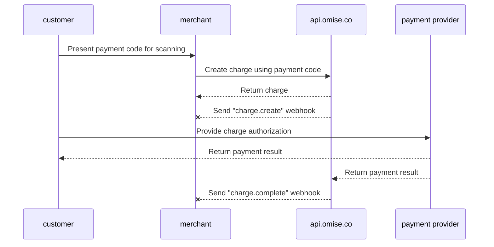

---
---
 
# User-Presented Mode Payment (B scan C)

<details>
  <summary><em>Topics covered on this page</em></summary>
- [How to enable](#how-to-enable)
- [Payment flow](#payment-flow)
- [Implementation](#implementation)
    - [Creating a charge](#creating-a-charge)
- [Setting the charge to expire](#setting-the-charge-to-expire)
    - [Completing the charge](#completing-the-charge)
- [Voids and refunds](#voids-and-refunds)
- [Limits](#limits)
- [Related API documentation](#related-api-documentation)
- [How to check the public key and secret key](#how-to-check-the-public-key-and-secret-key)


</details>


Accept in-store payments from Alipay+ users through your point-of-sale system (POS) using the **Alipay+ User-Presented Mode Payment (B scan C)** payment method.

This guide walks you through the payment flow and details how to implement it.

## How to enable

**Supported Countries:** Thailand, Singapore, Malaysia  
**Minimum API version:** `2017-11-02`

| Supported Wallets | Thailand | Singapore | Malaysia |
|-------------------|----------|-----------|----------|
| Alipay CN         | ✅        | ✅         |          |
| Alipay HK         | ✅        | ✅         | ✅        |
| KakaoPay          | ✅        | ✅         | ✅        |
| GCash             |          | ✅         | ✅        |
| Touch 'n Go       | ✅        | ✅         |          |
| TrueMoney         |          | ✅         | ✅        |

To enable User-Presented Mode Payment (B scan C), send an email requesting this feature to [support@omise.co](mailto:support@omise.co). You will need to review and accept new terms and conditions.

## Payment flow

Customers paying via User-Presented Mode Payment (B scan C) present their payment code (barcode or QR code) to you. To create a charge, you must scan the payment code using a barcode reader.


1️⃣ The customer opens an Alipay+ supported wallet on their mobile phone.  
2️⃣ Then, the customer generates a QR code in the wallet application and displays it to the merchant.  
3️⃣ The merchant scans the QR code with a QR code reader.  
4️⃣ The customer confirms payment in the wallet application.  
5️⃣ When the payment is successful, the wallet application will notify the customer.

## Implementation

Make the following API requests to create a charge using **User-Presented Mode Payment (B scan C).**

1. Create a new [charge](/charges-api#create) specifying the required parameters.
2. After receiving the charge completion webhook event, retrieve the charge to verify its status (optional, but recommended).

Use your **secret key** to create the User-Presented Mode Payment (B scan C) charge.

## Creating a charge

When the payer confirms they wish to use this payment method, create a [charge](/charges-api) specifying the following parameters: `amount`, `currency`, `source[type]` (alipayplus_upm), and `source[barcode]`.

| Parameter           | Type    | Description                                                              |
|---------------------|---------|--------------------------------------------------------------------------|
| `amount`            | integer | (required) Amount in subunits of source currency                         |
| `currency`          | string  | (required) Currency for source as three-letter ISO 4217 code             |
| `source[type]`      | string  | (required) Payment source type `alipayplus_upm`                           |
| `source[barcode]`   | string  | (required) Payment code (barcode) number read by your scanner             |

The following example demonstrates how to create a charge using curl. Replace `$OMISE_SECRET_KEY` with the test secret key found on [your dashboard](https://sso-idp.omise.co/realms/engagement/protocol/openid-connect/auth?client_id=dashboard&redirect_uri=https%3A%2F%2Fdashboard.omise.co%2Fv2&state=105360ec-75e1-4633-84ce-37f575a481a9&response_mode=fragment&response_type=code&scope=openid&nonce=bad19825-6662-494c-b3fa-c4f8cb8fb998&ui_locales=en&code_challenge=CzHJ3LuoY9_1i1l3AnT_kyyJV_UIkVKcWnjldQ4S49s&code_challenge_method=S256).

```bash
curl https://api.omise.co/charges \
  -u $OMISE_SECRET_KEY: \
  -d "amount=150000" \
  -d "currency=THB" \
  -d "source[type]=alipayplus_upm" \
  -d "source[barcode]=2897991359827699709"
```

```bash
{
  "object": "charge",
  "id": "chrg_test_611binawoqhcagslthw",
  "location": "/charges/chrg_test_611binawoqhcagslthw",
  "amount": 150000,
  "acquirer_reference_number": null,
  "net": 147352,
  "fee": 2475,
  "fee_vat": 173,
  "interest": 0,
  "interest_vat": 0,
  "funding_amount": 150000,
  "refunded_amount": 0,
  "transaction_fees": {
    "fee_flat": "0.0",
    "fee_rate": "1.65",
    "vat_rate": "7.0"
  },
  "platform_fee": {
    "fixed": null,
    "amount": null,
    "percentage": null
  },
  "currency": "THB",
  "funding_currency": "THB",
  "ip": null,
  "refunds": {
    "object": "list",
    "data": [],
    "limit": 20,
    "offset": 0,
    "total": 0,
    "location": "/charges/chrg_test_611binawoqhcagslthw/refunds",
    "order": "chronological",
    "from": "1970-01-01T00:00:00Z",
    "to": "2024-09-10T03:57:36Z"
  },
  "link": null,
  "description": null,
  "metadata": {},
  "card": null,
  "source": {
    "object": "source",
    "id": "src_test_611binao6nfn751k7e1",
    "livemode": false,
    "location": "/sources/src_test_611binao6nfn751k7e1",
    "amount": 150000,
    "barcode": "2897991359827699709",
    "bank": null,
    "created_at": "2024-09-10T03:57:36Z",
    "currency": "THB",
    "email": null,
    "flow": "offline",
    "installment_term": null,
    "ip": null,
    "absorption_type": null,
    "name": null,
    "mobile_number": null,
    "phone_number": null,
    "platform_type": null,
    "scannable_code": null,
    "billing": null,
    "shipping": null,
    "items": [],
    "references": null,
    "provider_references": null,
    "store_id": null,
    "store_name": null,
    "terminal_id": null,
    "type": "alipayplus_upm",
    "zero_interest_installments": null,
    "charge_status": "pending",
    "receipt_amount": null,
    "discounts": [],
    "promotion_code": null
  },
  "schedule": null,
  "linked_account": null,
  "customer": null,
  "dispute": null,
  "transaction": null,
  "failure_code": null,
  "failure_message": null,
  "status": "pending",
  "authorize_uri": null,
  "return_uri": null,
  "created_at": "2024-09-10T03:57:36Z",
  "paid_at": null,
  "authorized_at": null,
  "expires_at": "2024-09-17T03:57:36Z",
  "expired_at": null,
  "reversed_at": null,
  "zero_interest_installments": false,
  "branch": null,
  "terminal": null,
  "device": null,
  "authorized": false,
  "capturable": false,
  "capture": true,
  "disputable": false,
  "livemode": false,
  "refundable": false,
  "partially_refundable": false,
  "reversed": false,
  "reversible": false,
  "voided": false,
  "paid": false,
  "expired": false,
  "can_perform_void": false,
  "approval_code": null
}
```
## Setting the charge to expire

User-Presented Mode Payment (B scan C) charges that have not yet been authorized (`status=pending`) can be set to expire immediately, canceling the charge:

```bash
curl https://api.omise.co/charges/$CHARGE_ID/expire \
  -X POST \
  -u $OMISE_SECRET_KEY:
```
## Completing the charge

You have created a new charge with its `status` set to `pending`. Other possible values for charge `status` are `successful`, `failed`, and `expired`.

The following sections detail how to authorize a charge, receive its completion webhook event, and update its status.




### Receiving the charge completion event

The best way to be notified about charge completion is by using [webhook events](/api-webhooks).

Set up a location on the merchant server to receive webhook events and add this location as a webhook endpoint [on the dashboard](https://sso-idp.omise.co/realms/engagement/protocol/openid-connect/auth?client_id=dashboard&redirect_uri=https%3A%2F%2Fdashboard.omise.co%2Fv2&state=53075ccb-f9f2-48cd-86b1-5832abd511b8&response_mode=fragment&response_type=code&scope=openid&nonce=b91aec0e-e4a0-4790-af76-e67a7bf86361&ui_locales=en&code_challenge=05XsRLkTZ9b149JDqFCsB3xXN3-_d9CGS_iCp0SLPy4&code_challenge_method=S256).

### Checking the charge status
After receiving this event, retrieve the charge using its `ID` and confirm that its `status` matches the `status` of the charge contained in the event.

 If the value of `status` is `successful`, you got paid.

 If the value of `status` is `failed`, check the `failure_code` and `failure_message` in the charge object for an explanation.

Possible failure codes are as follows:

| Failure Code            | Description                                                              |
|-------------------------|--------------------------------------------------------------------------|
| `payment_expired`        | Payment expired.                                                         |
| `payment_rejected`       | Payment rejected by the issuer.                                          |
| `insufficient_fund`      | Insufficient funds in the account or the payment method has reached its limit. |
| `failed_processing`      | General payment processing failure.                                      |

## Voids and refunds

You can void User-Presented Mode (B scan C) charges until 16:15 UTC on the transaction date and process partial or complete refunds within one year of the transaction.

## Limits

- **Thailand**:
  - **Minimum**: `2000` (THB 20.00)
  - **Maximum**: `15000000` (THB 150,000.00)
- **Singapore**:
  - **Minimum**: `100` (SGD 1.00)
  - **Maximum**: `2000000` (SGD 20,000.00)
- **Malaysia**:
  - **Minimum**: `100` (MYR 1.00)
  - **Maximum**: `3000000` (MYR 30,000.00)

## Related API documentation
- [Charge](https://example.com/charge)
- [Source](https://example.com/source)
- [Webhook](https://example.com/webhook)

## How to check the public key and secret key
For information on obtaining and checking the public and secret keys, please refer to [this document](https://example.com/document).
