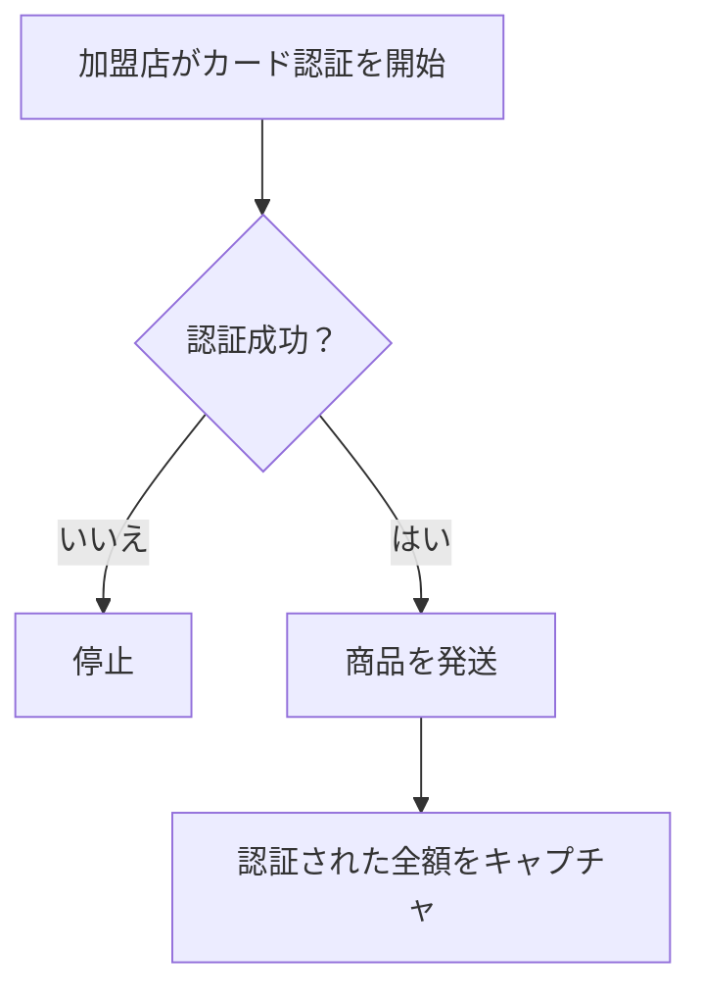
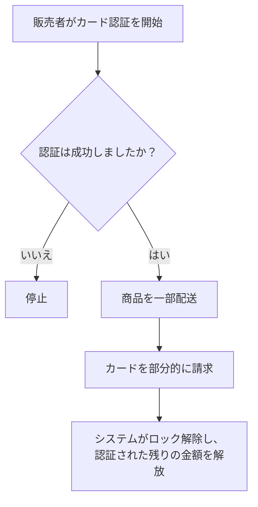

# キャプチャ


<details>
  <summary><em>このページで説明する内容</em></summary>

- [オーソリゼーションとキャプチャの理解](#オーソリゼーションとキャプチャの理解)
- [キャプチャの種類](#キャプチャの種類)
  - [自動キャプチャ](#自動キャプチャ)
  - [手動キャプチャ](#手動キャプチャ)
  - [全額手動キャプチャ](#全額手動キャプチャ)
  - [単一部分キャプチャ](#単一部分キャプチャ)
  - [複数部分キャプチャ](#複数部分キャプチャ)

</details>

このドキュメントでは、カード決済プロセスの手順を説明し、単一部分キャプチャ機能を紹介します。


import TOCInline from '@theme/TOCInline';

<!-- 
<TOCInline toc={toc} /> -->

## オーソリゼーションとキャプチャの理解

カード決済を完了するためには、オーソリゼーション（認証）とキャプチャ（売上確定）の2つのステップがあります。

オーソリゼーションは、購入時に加盟店が顧客のカードに対して課金を開始する際に行われます。このプロセスでは、決済代行業者がカード発行銀行に対して、口座残高が十分であり、口座が正常であることを確認します。条件を満たしていれば、取引金額が保留されます。カードの事前認証は、支払い方法が有効であり、カード所有者が本物であることを確認し、口座には課金せず、不正利用やチャージバックを防ぐために役立ちます。

オーソリゼーション期間は、認証が有効な期間です。この期間内にキャプチャを行う必要があります。この期間は国によって異なりますが、通常は7日間です。

キャプチャは、取引を完了するプロセスです。資金が顧客の口座から引き落とされ、加盟店の口座に振り込まれ、取引ステータスが保留から完了に変更されます。

## キャプチャの種類

キャプチャプロセスは、自動または手動で行うことができます。

## 自動キャプチャ

自動キャプチャでは、キャプチャ遅延時間に基づいて決済が自動的にキャプチャされます。キャプチャ遅延は、決済のオーソリゼーションとキャプチャの間の期間です。

自動キャプチャの場合、デフォルトではオーソリゼーション後すぐにキャプチャされます。

## 手動キャプチャ

手動キャプチャでは、加盟店がオーソリゼーションが有効な間に、各決済ごとにキャプチャを明示的にリクエストする必要があります。

手動キャプチャには以下の種類があります：

- 全額手動キャプチャ
- 単一部分キャプチャ
- 複数部分キャプチャ

## 全額手動キャプチャ

全額手動キャプチャでは、認証された金額が全額キャプチャされます。

フロー例は次のとおりです：

<div class="center-mermaid">


</div>

### 使い方

### オーソリゼーション

### トークンを使用してカード上に認証ホールドを作成

```
curl https://api.omise.co/charges \
  -u $OMISE_SECRET_KEY: \
  -d "amount=7000" \
  -d "currency=thb" \
  -d "capture=false" \
  -d "card=$TOKEN_ID"
```

## キャプチャ
次の例は、THB 70 の完全キャプチャを示しています。

```
curl https://api.omise.co/charges/$FULL_UNCAPTURED_CHARGE_ID/capture \
  -u $OMISE_SECRET_KEY: \
  -d "capture_amount=7000"
```

## 単一部分的キャプチャ

単一部分的キャプチャを例を使って説明します。

例えば、顧客がTHB 70相当の商品を購入したとします。そのカードはTHB 70でオーソライズされます。しかし、商人はTHB 40相当の商品しか提供できません。最終的な請求額はTHB 40となり、これが顧客のカードに請求されます。オーソライズされたが請求されなかった残りのTHB 30は解除され、解放されます。

*顧客のカードにTHB 40を請求した取引が、単一部分的キャプチャです。*

次のようなフローになります：

<div class="center-mermaid">


</div>

### 単一部分的キャプチャを有効にする方法
単一部分的キャプチャはデフォルトで有効になっています。

### 使用例

### オーソリ
次の例では、カードトークンを使用してTHB 70のチャージをオーソライズします：

```
curl https://api.omise.co/charges \
  -u $OMISE_SECRET_KEY: \
  -d "amount=7000" \
  -d "currency=thb" \
  -d "capture=false" \
  -d "card=$ANOTHER_TOKEN_ID" \
  -d "authorization_type=pre_auth"
 ```

### キャプチャ

次の例は、THB 40の単一部分的キャプチャを示しています。

```
curl https://api.omise.co/charges/$PARTIAL_UNCAPTURED_CHARGE_ID/capture \
  -u $OMISE_SECRET_KEY: \
  -d "capture_amount=4000"
```

## 複数部分的キャプチャ

現在、Omiseは複数部分的キャプチャをサポートしていません。
