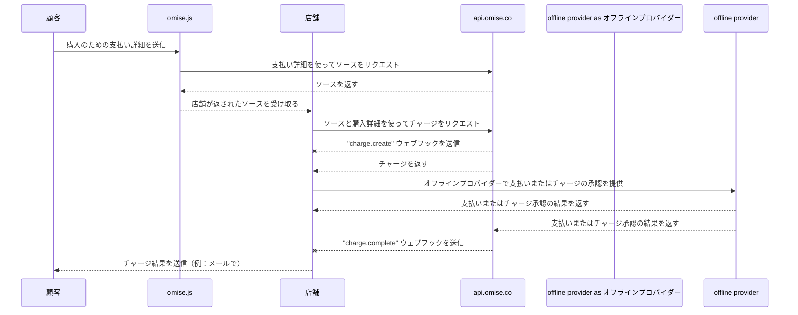

---
---

# マーチャント提示型モード（CスキャンB）

<details>
  <summary><em>このページで取り扱うトピック</em></summary>

- [有効化する方法](#有効化する方法)  
- [支払いフロー](#支払いフロー)  
- [実装方法](#実装方法)  
  - [ソースの作成](#ソースの作成)  
  - [チャージの作成](#チャージの作成)  
  - [ソースとチャージの同時作成](#ソースとチャージの同時作成)  
- [チャージの有効期限を設定する](#チャージの有効期限を設定する)  
  - [チャージを完了する](#チャージを完了する)  
- [取消しと返金](#取消しと返金)  
- [制限事項](#制限事項)  
- [関連APIドキュメント](#関連apiドキュメント)  
- [公開鍵と秘密鍵の確認方法](#公開鍵と秘密鍵の確認方法)  

</details>

Alipay+ ユーザーから店舗での支払いを、**Alipay+ マーチャント提示型モード決済（CスキャンB）** を使用して、POS（ポイント・オブ・セール）システム経由で受け付けましょう。

このガイドでは、支払いの流れを説明し、その実装方法について詳しく説明します。

## 有効化する方法

- **対応国：** タイ、シンガポール、マレーシア  
- **最低APIバージョン：** `2017-11-02`

| 対応ウォレット     | タイ | シンガポール | マレーシア |
|------------------|------|--------------|------------|
| アリペイ中国本土版      | ✅    | ✅            |            |
| アリペイ香港版        | ✅    | ✅            | ✅          |
| カカオペイ        | ✅    | ✅            | ✅          |
| ジーキャッシュ          |      | ✅            | ✅          |
| タッチ・アンド・ゴー      | ✅    | ✅            |            |
| トゥルーマネー        |      | ✅            | ✅          |

**マーチャント提示型モード（CスキャンB）** を有効にするには、[support@omise.co](mailto:support@omise.co) にこの機能をリクエストするメールを送信してください。利用には、新しい利用規約の確認および承諾が必要です。

## 支払いフロー

マーチャント提示型モード（CスキャンB）を通じて支払う顧客は、*オフライン* の支払いフローを経ます。つまり、一度チャージが作成されると、それは「オフライン」でのみ承認されます。この場合、顧客はスマートフォンの対応ウォレットアプリを使って、生成されたQRコードをスキャンし、支払いを完了する必要があります。

顧客が支払い方法としてマーチャント提示型モード（CスキャンB）を選択した後に、POS端末でQRコードを生成する必要があります。


❶ *顧客が、モバイル端末で Alipay+ 対応ウォレットを開きます。*  
❷ *その後、顧客がマーチャントのPOS端末に表示されたQRコードをスキャンします。*  
❸ *顧客が支払い情報を確認します。*  
❹ *顧客が支払いを確定します。*  
❺ *支払いが成功すると、ウォレットアプリが顧客に通知します。*

## 実装方法

**マーチャント提示型モード（CスキャンB）**を使用してチャージを作成するには、以下のAPIリクエストを行ってください。

1. [Omise.js](/th/omise-js/thailand) またはモバイルSDK（[iOS](https://github.com/omise/omise-ios)、[Android](https://github.com/omise/omise-android)）を使用し、```type``` が ```alipayplus_mpm``` の新しい支払い[source](/sources-api#create)を作成します。  
2. 手順1で作成した source の識別子を使用して、新しい[チャージ](/charges-api#create)を作成します。  
3. チャージ完了のWebhookイベントを受信した後、チャージを取得してステータスを確認します（*任意ですが推奨されます*）。

クライアント（顧客のブラウザまたはモバイル端末）側では **パブリックキー** を使用して、マーチャント提示型モード（CスキャンB）の source を作成します。サーバー側では **シークレットキー** を使用してチャージを作成します。

> source の作成とチャージの両方をサーバー側で行いたい場合は、[単一のAPIリクエスト](/alipayplus-mpm#creating-a-source-and-charge)でsourceを作成してチャージすることができます（シークレットキーを使用）。

## ソースの作成

顧客がこの決済方法での支払いを希望することを確認したら、```amount```, ```currency```, ```type``` を指定して新しい [source](/sources-api) を作成してください。

| パラメータ | 型       | 説明                                                                 |
|------------|----------|----------------------------------------------------------------------|
| 金額     | 整数     | **（必須）** 通貨の最小単位での金額                                        |
| 通貨    | 文字列   | **（必須）** 通貨を表す3文字のISO 4217コード（タイは```THB```, シンガポールは```SGD```, マレーシアは```MYR```） |
| 種類      | 文字列   | **（必須）** 支払いソースのタイプ：`alipayplus_mpm`                      |

以下の例は、฿1500 の新しい **マーチャント提示型モード（CスキャンB）** ソースを作成する方法を示しています。  
`omise_public_key` や `$OMISE_PUBLIC_KEY` は、[ダッシュボード](https://dashboard.omise.co/v2)で確認できるテスト用パブリックキーに置き換えてください。

> [Omise.js](/omise-js) を使用する場合、```type``` パラメータは ```createSource``` メソッドの第1引数として指定します。

```js
Omise.setPublicKey(omise_public_key);

Omise.createSource('alipayplus_mpm', {
  "amount": 150000,
  "currency": "THB"
}, function(statusCode, response) {
  console.log(response)
});
```
テスト用に、同じリクエストを `curl` を使って作成することができます。
```js
curl https://api.omise.co/sources \
  -u $OMISE_PUBLIC_KEY: \
  -d "amount=150000" \
  -d "currency=THB" \
  -d "type=alipayplus_mpm"
```

```js
{
  "object": "source",
  "id": "src_test_611bij45gvwnk2y1gah",
  "livemode": false,
  "location": "/sources/src_test_611bij45gvwnk2y1gah",
  "amount": 150000,
  "barcode": null,
  "bank": null,
  "created_at": "2024-09-10T03:57:16Z",
  "currency": "THB",
  "email": null,
  "flow": "offline",
  "installment_term": null,
  "ip": "35.198.236.178",
  "absorption_type": null,
  "name": null,
  "mobile_number": null,
  "phone_number": null,
  "platform_type": null,
  "scannable_code": null,
  "billing": null,
  "shipping": null,
  "items": [],
  "references": null,
  "provider_references": null,
  "store_id": null,
  "store_name": null,
  "terminal_id": null,
  "type": "alipayplus_mpm",
  "zero_interest_installments": null,
  "charge_status": "unknown",
  "receipt_amount": null,
  "discounts": [],
  "promotion_code": null
}
```
`id` 属性はソース識別子です（`src` で始まります）。

## チャージの作成

`source`、`amount`、`currency` のパラメータを指定してチャージを作成します。

- `source` はソース識別子を指定します。
- `amount` と `currency` はソースと一致する必要があります。

以下の例は、`curl` を使用して新しいチャージを作成する方法を示しています。 `$OMISE_SECRET_KEY` を [ダッシュボード](https://sso-idp.omise.co/realms/engagement/protocol/openid-connect/auth?client_id=dashboard&redirect_uri=https%3A%2F%2Fdashboard.omise.co%2Fv2&state=aa61f3e1-7f68-4dea-8b3b-ec284cf5b541&response_mode=fragment&response_type=code&scope=openid&nonce=2891768c-7129-4f6a-bee9-f850c2c7e62b&ui_locales=en&code_challenge=VZNxDWaKKiuqN1FTu5eeqlTkJzve7NbkRcsp3QR3u9c&code_challenge_method=S256) のテストシークレットキーに置き換えてください。 `$SOURCE_ID` をソースの `id` に置き換えてください。

```bash
curl https://api.omise.co/charges \
  -u $OMISE_SECRET_KEY: \
  -d "amount=150000" \
  -d "currency=THB" \
  -d "source=$SOURCE_ID"

```

```bash
{
  "object": "charge",
  "id": "chrg_test_611bij7kcn967m8wk55",
  "location": "/charges/chrg_test_611bij7kcn967m8wk55",
  "amount": 150000,
  "acquirer_reference_number": null,
  "net": 147352,
  "fee": 2475,
  "fee_vat": 173,
  "interest": 0,
  "interest_vat": 0,
  "funding_amount": 150000,
  "refunded_amount": 0,
  "transaction_fees": {
    "fee_flat": "0.0",
    "fee_rate": "1.65",
    "vat_rate": "7.0"
  },
  "platform_fee": {
    "fixed": null,
    "amount": null,
    "percentage": null
  },
  "currency": "THB",
  "funding_currency": "THB",
  "ip": null,
  "refunds": {
    "object": "list",
    "data": [],
    "limit": 20,
    "offset": 0,
    "total": 0,
    "location": "/charges/chrg_test_611bij7kcn967m8wk55/refunds",
    "order": "chronological",
    "from": "1970-01-01T00:00:00Z",
    "to": "2024-09-10T03:57:17Z"
  },
  "link": null,
  "description": null,
  "metadata": {},
  "card": null,
  "source": {
    "object": "source",
    "id": "src_test_611biilt86wyemof3ha",
    "livemode": false,
    "location": "/sources/src_test_611biilt86wyemof3ha",
    "amount": 150000,
    "barcode": null,
    "bank": null,
    "created_at": "2024-09-10T03:57:14Z",
    "currency": "THB",
    "email": null,
    "flow": "offline",
    "installment_term": null,
    "ip": "35.198.236.178",
    "absorption_type": null,
    "name": null,
    "mobile_number": null,
    "phone_number": null,
    "platform_type": null,
    "scannable_code": {
      "object": "barcode",
      "type": "qr",
      "image": {
        "object": "document",
        "livemode": false,
        "id": "docu_test_611bij9cng91h6xcqoe",
        "deleted": false,
        "filename": "qrcode.svg",
        "location": "/charges/chrg_test_611bij7kcn967m8wk55/documents/docu_test_611bij9cng91h6xcqoe",
        "kind": "qr",
        "download_uri": "https://api.omise.co/charges/chrg_test_611bij7kcn967m8wk55/documents/docu_test_611bij9cng91h6xcqoe/downloads/FED7CA673265A075",
        "created_at": "2024-09-10T03:57:17Z"
      }
    },
    "billing": null,
    "shipping": null,
    "items": [],
    "references": null,
    "provider_references": null,
    "store_id": null,
    "store_name": null,
    "terminal_id": null,
    "type": "alipayplus_mpm",
    "zero_interest_installments": null,
    "charge_status": "pending",
    "receipt_amount": null,
    "discounts": [],
    "promotion_code": null
  },
  "schedule": null,
  "linked_account": null,
  "customer": null,
  "dispute": null,
  "transaction": null,
  "failure_code": null,
  "failure_message": null,
  "status": "pending",
  "authorize_uri": null,
  "return_uri": null,
  "created_at": "2024-09-10T03:57:17Z",
  "paid_at": null,
  "authorized_at": null,
  "expires_at": "2024-09-11T03:57:17Z",
  "expired_at": null,
  "reversed_at": null,
  "zero_interest_installments": false,
  "branch": null,
  "terminal": null,
  "device": null,
  "authorized": false,
  "capturable": false,
  "capture": true,
  "disputable": false,
  "livemode": false,
  "refundable": false,
  "partially_refundable": false,
  "reversed": false,
  "reversible": false,
  "voided": false,
  "paid": false,
  "expired": false,
  "can_perform_void": false,
  "approval_code": null
}
```
## ソースとチャージの作成

別の方法として、1回のAPIリクエストでソースを作成し、チャージすることができます。

```bash
curl https://api.omise.co/charges \
  -u $OMISE_SECRET_KEY: \
  -d "amount=150000" \
  -d "currency=THB" \
  -d "source[type]=alipayplus_mpm"
```
## チャージの期限を設定する

まだ承認されていない（`status=pending`）マーチャント提示型モード（CスキャンB）のチャージは、即座に期限切れに設定でき、チャージがキャンセルされます。

```bash
curl https://api.omise.co/charges/$CHARGE_ID/expire \
  -X POST \
  -u $OMISE_SECRET_KEY:
```

## チャージの完了

新しいチャージを作成し、その `status` を `pending` に設定しました。チャージの `status` には、`successful`、`failed`、および `expired` という他の値もあります。

以下のセクションでは、チャージを承認する方法、完了したチャージのウェブフックイベントを受信する方法、およびそのステータスを更新する方法を詳しく説明します。


## チャージの承認

チャージ作成時に生成されたQRコードを顧客に提示します。顧客はQRコードを自分のスマートフォンでスキャンして、チャージを承認します。

テストモードでは、承認フェーズをシミュレートできます。ダッシュボードで特定のチャージに移動し、`アクション` をクリックして、チャージを手動で `成功` または `失敗` としてマークします。

チャージオブジェクト内でQRコードを次のように見つけることができます：

```json
charge:
  source:
    scannable_code:
      image:
        download_uri: QR code image to present to the customer
```

```json
{
  "object": "barcode",
  "type": "qr",
  "image": {
    "object": "document",
    "livemode": false,
    "id": "docu_test_611biix70q8edqvo2tk",
    "deleted": false,
    "filename": "qrcode.svg",
    "location": "/charges/chrg_test_611biisxzxinpqmp4gt/documents/docu_test_611biix70q8edqvo2tk",
    "kind": "qr",
    "download_uri": "https://api.omise.co/charges/chrg_test_611biisxzxinpqmp4gt/documents/docu_test_611biix70q8edqvo2tk/downloads/754A57240DF61325",
    "created_at": "2024-09-10T03:57:15Z"
  }
}
```
## チャージ完了イベントの受信

チャージ完了について通知を受け取る最良の方法は、[Webhookイベント](/api-webhooks)を使用することです。

商業サーバーにWebhookイベントを受け取る場所を設定し、この場所をダッシュボードでWebhookエンドポイントとして追加します。

## チャージのステータス確認

このイベントを受け取った後、`id` を使用してチャージを取得し、イベント内のチャージの `status` と一致することを確認します。

もし `status` の値が `successful` であれば、支払いが完了したことになります。

もし `status` の値が `failed` であれば、チャージオブジェクト内の `failure_code` と `failure_message` を確認して、理由を調べてください。

考えられる失敗コードは以下の通りです。

| 失敗コード           | 説明                                                                                             |
|----------------------|--------------------------------------------------------------------------------------------------|
| `payment_expired`     | 支払いが期限切れです。                                                                            |
| `payment_rejected`    | 支払いが発行者によって拒否されました。                                                           |
| `insufficient_fund`   | アカウントの残高不足、または支払い方法が限度額に達しました。                                     |
| `failed_processing`   | 一般的な支払い処理の失敗です。                                                                   |

## 取り消しと返金

Merchant-Presented Mode (C scan B)のチャージは、取引日から16:15 UTCまで取り消すことができ、取引日から1年以内であれば部分的または全額返金を処理できます。

## 制限

**タイ Thailand**

- 最小: `2000` (THB 20.00)
- 最大: `15000000` (THB 150,000.00)

**シンガポール Singapore**

- 最小: `100` (SGD 1.00)
- 最大: `2000000` (SGD 20,000.00)

**マレーシア Malaysia**

- 最小: `100` (MYR 1.00)
- 最大: `3000000` (MYR 30,000.00)

## 関連APIドキュメント

- [チャージ](#)
- [ソース](#)
- [Webhook](#)

## 公開キーと秘密キーの確認方法

公開キーと秘密キーの取得および確認方法については、このドキュメントを参照してください。
