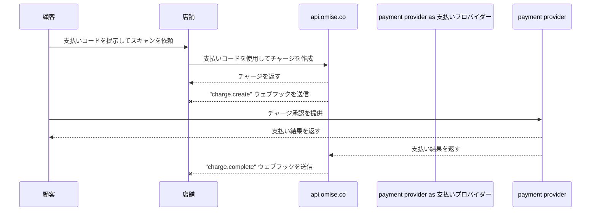

---
---
 # ユーザ提示型モード決済（BスキャンC）

<details>
  <summary><em>このページで扱うトピック</em></summary>
- [有効化方法](#how-to-enable)
- [支払いの流れ](#payment-flow)
- [実装](#implementation)
    - [チャージの作成](#creating-a-charge)
- [チャージの期限を設定する](#setting-the-charge-to-expire)
    - [チャージの完了](#completing-the-charge)
- [取り消しと返金](#voids-and-refunds)
- [制限](#limits)
- [関連APIドキュメント](#related-api-documentation)
- [公開キーと秘密キーの確認方法](#how-to-check-the-public-key-and-secret-key)
</details>

Alipay+ ユーザーから店舗での支払いを **Alipay+ ユーザ提示型モード決済（BスキャンC）** を使用して、POS（ポイント・オブ・セール）システム経由で受け付けましょう。

このガイドでは、支払いの流れと実装方法を詳しく説明します。

## 有効化方法

**対応国:** タイ、シンガポール、マレーシア  
**最小APIバージョン:** `2017-11-02`

| 対応ウォレット     | タイ       | シンガポール | マレーシア |
|-------------------|-----------|-------------|-----------|
| アリペイ CN         | ✅        | ✅          |           |
| アリペイ HK         | ✅        | ✅          | ✅        |
| カオペイ          | ✅        | ✅          | ✅        |
| ジーキャッシュ            |           | ✅          | ✅        |
| タッチ・アンド・ゴー     | ✅        | ✅          |           |
| トゥルー・マネー         |           | ✅          | ✅        |

**ユーザ提示型モード決済（BスキャンC）** を有効にするには、この機能をリクエストするために [support@omise.co](mailto:support@omise.co) にメールを送信してください。新しい利用規約に同意する必要があります。

## 支払いの流れ

ユーザ提示型モード決済（BスキャンC）を使用して支払う顧客は、自分の支払いコード（バーコードまたはQRコード）を提示します。チャージを作成するために、バーコードリーダーを使って支払いコードをスキャンする必要があります。


1️⃣ 顧客がモバイル端末でAlipay+対応ウォレットを開きます。  
2️⃣ 顧客がウォレットアプリケーションでQRコードを生成し、それを店舗に提示します。  
3️⃣ 店舗がQRコードをQRコードリーダーでスキャンします。  
4️⃣ 顧客がウォレットアプリケーションで支払いを確認します。  
5️⃣ 支払いが成功すると、ウォレットアプリケーションが顧客に通知します。

## 実装

**ユーザ提示型モード決済（BスキャンC）** を使用してチャージを作成するには、次のAPIリクエストを行います。

1. 必要なパラメータを指定して新しい [チャージ](/charges-api#create) を作成します。
2. チャージ完了のWebhookイベントを受け取った後、チャージを取得してそのステータスを確認します（オプションですが推奨）。

**秘密キー** を使用して、ユーザ提示型モード決済（BスキャンC）のチャージを作成します。

## チャージの作成

顧客がこの支払い方法を使用することを確認したら、次のパラメータを指定して [チャージ](/charges-api) を作成します：  金額 t`、`currency`、`source[type]`（alipayplus_upm）、および `source[barcode]`。

| パラメータ            | 型      | 説明                                                      |
|-----------------------|---------|-----------------------------------------------------------|
| ` 金額 `              | integer | （必須）通貨のサブユニットで指定した金額                    |
| `通貨 `            | string  | （必須）ソースの通貨（3文字ISO 4217コード）                |
| `ソース[type]`        | string  | （必須）支払いソースの種類 `alipayplus_upm`               |
| `ソース[barcode]`     | string  | （必須）スキャナーで読み取った支払いコード（バーコード）   |

次の例は、`curl` を使用してチャージを作成する方法を示しています。`$OMISE_SECRET_KEY` を [ダッシュボード](https://sso-idp.omise.co/realms/engagement/protocol/openid-connect/auth?client_id=dashboard&redirect_uri=https%3A%2F%2Fdashboard.omise.co%2Fv2&state=105360ec-75e1-4633-84ce-37f575a481a9&response_mode=fragment&response_type=code&scope=openid&nonce=bad19825-6662-494c-b3fa-c4f8cb8fb998&ui_locales=en&code_challenge=CzHJ3LuoY9_1i1l3AnT_kyyJV_UIkVKcWnjldQ4S49s&code_challenge_method=S256) で取得したテスト秘密キーに置き換えます。

```bash
curl https://api.omise.co/charges \
  -u $OMISE_SECRET_KEY: \
  -d "amount=150000" \
  -d "currency=THB" \
  -d "source[type]=alipayplus_upm" \
  -d "source[barcode]=2897991359827699709"
```

```bash
{
  "object": "charge",
  "id": "chrg_test_611binawoqhcagslthw",
  "location": "/charges/chrg_test_611binawoqhcagslthw",
  "amount": 150000,
  "acquirer_reference_number": null,
  "net": 147352,
  "fee": 2475,
  "fee_vat": 173,
  "interest": 0,
  "interest_vat": 0,
  "funding_amount": 150000,
  "refunded_amount": 0,
  "transaction_fees": {
    "fee_flat": "0.0",
    "fee_rate": "1.65",
    "vat_rate": "7.0"
  },
  "platform_fee": {
    "fixed": null,
    "amount": null,
    "percentage": null
  },
  "currency": "THB",
  "funding_currency": "THB",
  "ip": null,
  "refunds": {
    "object": "list",
    "data": [],
    "limit": 20,
    "offset": 0,
    "total": 0,
    "location": "/charges/chrg_test_611binawoqhcagslthw/refunds",
    "order": "chronological",
    "from": "1970-01-01T00:00:00Z",
    "to": "2024-09-10T03:57:36Z"
  },
  "link": null,
  "description": null,
  "metadata": {},
  "card": null,
  "source": {
    "object": "source",
    "id": "src_test_611binao6nfn751k7e1",
    "livemode": false,
    "location": "/sources/src_test_611binao6nfn751k7e1",
    "amount": 150000,
    "barcode": "2897991359827699709",
    "bank": null,
    "created_at": "2024-09-10T03:57:36Z",
    "currency": "THB",
    "email": null,
    "flow": "offline",
    "installment_term": null,
    "ip": null,
    "absorption_type": null,
    "name": null,
    "mobile_number": null,
    "phone_number": null,
    "platform_type": null,
    "scannable_code": null,
    "billing": null,
    "shipping": null,
    "items": [],
    "references": null,
    "provider_references": null,
    "store_id": null,
    "store_name": null,
    "terminal_id": null,
    "type": "alipayplus_upm",
    "zero_interest_installments": null,
    "charge_status": "pending",
    "receipt_amount": null,
    "discounts": [],
    "promotion_code": null
  },
  "schedule": null,
  "linked_account": null,
  "customer": null,
  "dispute": null,
  "transaction": null,
  "failure_code": null,
  "failure_message": null,
  "status": "pending",
  "authorize_uri": null,
  "return_uri": null,
  "created_at": "2024-09-10T03:57:36Z",
  "paid_at": null,
  "authorized_at": null,
  "expires_at": "2024-09-17T03:57:36Z",
  "expired_at": null,
  "reversed_at": null,
  "zero_interest_installments": false,
  "branch": null,
  "terminal": null,
  "device": null,
  "authorized": false,
  "capturable": false,
  "capture": true,
  "disputable": false,
  "livemode": false,
  "refundable": false,
  "partially_refundable": false,
  "reversed": false,
  "reversible": false,
  "voided": false,
  "paid": false,
  "expired": false,
  "can_perform_void": false,
  "approval_code": null
}
```
## チャージの期限を設定する

ユーザ提示型モード決済（BスキャンC）で、まだ承認されていない（`status=pending`）チャージは、即座に期限切れに設定でき、チャージがキャンセルされます：

```bash
curl https://api.omise.co/charges/$CHARGE_ID/expire \
  -X POST \
  -u $OMISE_SECRET_KEY:
```
## チャージの完了

新しいチャージを作成し、その`status`を`pending`に設定しました。チャージの`status`には、`successful`、`failed`、`expired`の他の値もあります。

以下のセクションでは、チャージを承認する方法、完了したWebhookイベントを受信する方法、およびそのステータスを更新する方法について説明します。


### チャージ完了イベントの受信

チャージ完了の通知を受け取る最良の方法は、[Webhookイベント](/api-webhooks)を使用することです。

マーチャントサーバーにWebhookイベントを受信する場所を設定し、この場所を[ダッシュボード](https://sso-idp.omise.co/realms/engagement/protocol/openid-connect/auth?client_id=dashboard&redirect_uri=https%3A%2F%2Fdashboard.omise.co%2Fv2&state=53075ccb-f9f2-48cd-86b1-5832abd511b8&response_mode=fragment&response_type=code&scope=openid&nonce=b91aec0e-e4a0-4790-af76-e67a7bf86361&ui_locales=en&code_challenge=05XsRLkTZ9b149JDqFCsB3xXN3-_d9CGS_iCp0SLPy4&code_challenge_method=S256)にWebhookエンドポイントとして追加します。

### チャージステータスの確認

このイベントを受信した後、`ID`を使用してチャージを取得し、その`status`がイベント内のチャージの`status`と一致していることを確認します。

- `status`の値が`successful`の場合、支払いが完了しました。
- `status`の値が`failed`の場合、`failure_code`と`failure_message`をチャージオブジェクト内で確認して、説明を取得します。

可能な失敗コードは以下の通りです。

| 失敗コード             | 説明                                                                          |
|-----------------------|-------------------------------------------------------------------------------|
| `支払い期限切れ`      | 支払いが期限切れです。                                                          |
| `支払い拒否`     | 発行者によって支払いが拒否されました。                                          |
| `残高不足`    | アカウントに十分な資金がないか、支払い方法の制限に達しました。                    |
| `処理失敗`    | 一般的な支払い処理の失敗。                                                      |

## 取り消しと返金

User-Presented Mode (B scan C) のチャージは、取引日 UTC 16:15 までに取り消すことができ、取引から1年以内に部分返金または全額返金を処理できます。

## 制限

- **タイ Thailand**:
  - **最小**: `2000` (THB 20.00)
  - **最大**: `15000000` (THB 150,000.00)
- **シンガポール Singapore**:
  - **最小**: `100` (SGD 1.00)
  - **最大**: `2000000` (SGD 20,000.00)
- **マレーシア Malaysia**:
  - **最小**: `100` (MYR 1.00)
  - **最大**: `3000000` (MYR 30,000.00)

## 関連するAPIドキュメント
- [Charge](https://example.com/charge)
- [Source](https://example.com/source)
- [Webhook](https://example.com/webhook)

## 公開鍵と秘密鍵の確認方法
公開鍵と秘密鍵を取得して確認する方法については、[こちらのドキュメント](https://example.com/document)をご参照ください。
