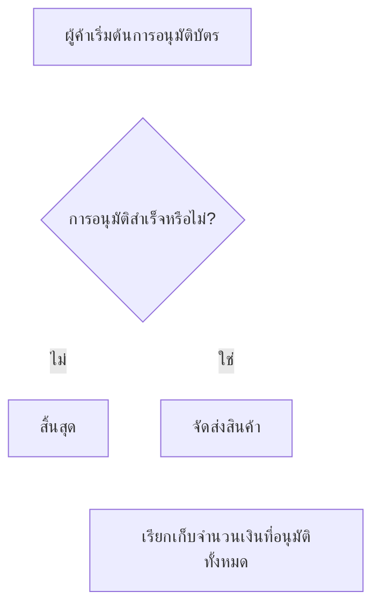

# การจับ

<details>
  <summary><em>หัวข้อในหน้านี้</em></summary>

- [ความเข้าใจเกี่ยวกับการอนุมัติและการจับ](#ความเข้าใจเกี่ยวกับการอนุมัติและการจับ)
- [ประเภทของการจับ](#ประเภทของการจับ)
  - [การจับอัตโนมัติ](#การจับอัตโนมัติ)
  - [การจับแบบแมนนวล](#การจับแบบแมนนวล)
  - [การจับแบบแมนนวลทั้งหมด](#การจับแบบแมนนวลทั้งหมด)
  - [การจับบางส่วนแบบครั้งเดียว](#การจับบางส่วนแบบครั้งเดียว)
  - [การจับบางส่วนแบบหลายครั้ง](#การจับบางส่วนแบบหลายครั้ง)

</details>

เอกสารนี้อธิบายขั้นตอนในกระบวนการชำระเงินด้วยบัตรและแนะนำฟังก์ชัน *การจับบางส่วนแบบครั้งเดียว*.

import TOCInline from '@theme/TOCInline';

<!-- 
<TOCInline toc={toc} /> -->

## ความเข้าใจเกี่ยวกับการอนุมัติและการจับ

การอนุมัติและการจับเป็นสองขั้นตอนในกระบวนการชำระเงินด้วยบัตร.

การอนุมัติเกิดขึ้นเมื่อผู้ขายเริ่มการหักเงินจากบัตรของลูกค้าในขั้นตอนการชำระเงิน ในระหว่างกระบวนการนี้ ผู้ให้บริการชำระเงินจะตรวจสอบกับธนาคารของเจ้าของบัตรว่าบัญชีมีเงินเพียงพอและอยู่ในสภาพดีหรือไม่ หากเงื่อนไขต่างๆ เป็นไปตามที่กำหนด ยอดเงินจะถูกสำรองไว้ การอนุมัติล่วงหน้าของบัตรช่วยให้มั่นใจได้ว่า วิธีการชำระเงินมีความถูกต้องและเจ้าของบัตรเป็นผู้ที่แท้จริง โดยไม่ต้องหักเงินจากบัญชีจริง ซึ่งจะช่วยลดการขอเงินคืน.

ระยะเวลาอนุมัติคือช่วงเวลาที่การอนุมัติยังคงมีผลอยู่ ยอดเงินต้องถูกจับภายในระยะเวลานี้ โดยปกติแล้วจะอยู่ที่ 7 วัน แม้ว่าจะขึ้นอยู่กับประเทศที่ทำธุรกรรม.

การจับคือกระบวนการที่การทำธุรกรรมเสร็จสมบูรณ์ เงินจะถูกหักออกจากบัญชีของลูกค้าและโอนเข้าบัญชีของผู้ขาย ทำให้สถานะของการทำธุรกรรมเปลี่ยนจาก *รอดำเนินการ* เป็น *เสร็จสมบูรณ์*.

## ประเภทของการจับ

กระบวนการจับสามารถทำได้ทั้งแบบอัตโนมัติหรือแบบแมนนวล.

## การจับอัตโนมัติ

ในการจับอัตโนมัติ การชำระเงินจะถูกจับโดยอัตโนมัติตามระยะเวลาการจับ การจับจะเกิดขึ้นหลังจากการอนุมัติบัตรโดยอัตโนมัติ.

โดยทั่วไปแล้ว การจับอัตโนมัติจะเกิดขึ้นทันทีหลังจากการอนุมัติ.

## การจับแบบแมนนวล

ในการจับแบบแมนนวล ผู้ขายต้องขอให้ทำการจับสำหรับการชำระเงินแต่ละครั้งก่อนที่การอนุมัติจะหมดอายุ.

การจับแบบแมนนวลแบ่งออกเป็นประเภทดังนี้:

- การจับแบบแมนนวลทั้งหมด
- การจับบางส่วนแบบครั้งเดียว
- การจับบางส่วนแบบหลายครั้ง

## การจับแบบแมนนวลทั้งหมด

ในการจับแบบแมนนวลทั้งหมด จำนวนเงินที่ได้รับอนุมัติทั้งหมดจะถูกจับ.

กระบวนการตัวอย่างมีดังนี้:


<div class="center-mermaid">


</div>

### การใช้งาน

### การอนุมัติ

### สร้างการระงับอนุมัติด้วยโทเค็นบนบัตร


```
curl https://api.omise.co/charges \
  -u $OMISE_SECRET_KEY: \
  -d "amount=7000" \
  -d "currency=thb" \
  -d "capture=false" \
  -d "card=$TOKEN_ID"
```
## การจับ

ตัวอย่างต่อไปนี้แสดงการจับทั้งหมดจำนวน 70 THB


```
curl https://api.omise.co/charges/$FULL_UNCAPTURED_CHARGE_ID/capture \
  -u $OMISE_SECRET_KEY: \
  -d "capture_amount=7000"
```

## การจับบางส่วน

เราจะอธิบายการจับบางส่วนโดยใช้ตัวอย่าง

สมมติว่าลูกค้าซื้อสินค้ามูลค่า 70 THB และบัตรของเขาจะได้รับการอนุมัติจำนวน 70 THB อย่างไรก็ตามผู้ค้าสามารถส่งสินค้ามูลค่าเพียง 40 THB เท่านั้น ยอดบิลสุดท้ายคือ 40 THB ซึ่งจะถูกเรียกเก็บจากลูกค้า ส่วนที่เหลืออีก 30 THB ที่ได้รับการอนุมัติแต่ไม่ได้เรียกเก็บจะถูกปล่อยออก

*การทำธุรกรรมที่เรียกเก็บ 40 THB จากบัญชีลูกค้าเป็นการจับบางส่วน*

กระบวนการที่แสดงมีดังนี้:
