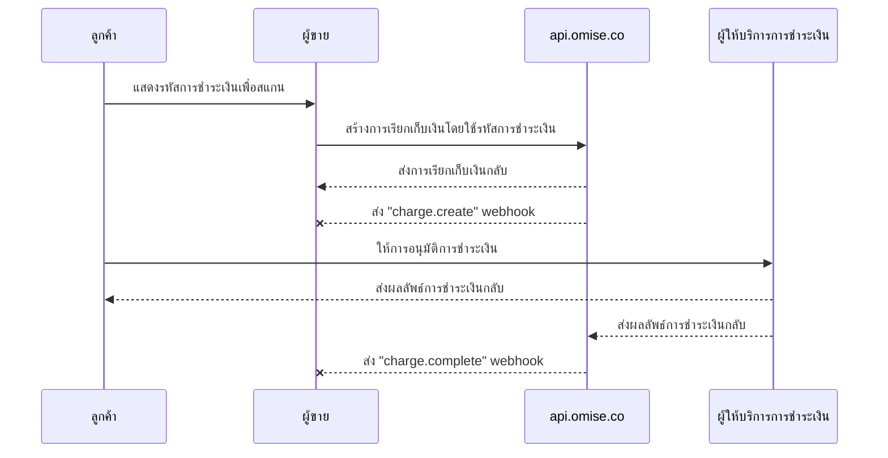

---
---
# การชำระเงินในโหมดที่ลูกค้านำเสนอ (B scan C)

<details>
  <summary><em>หัวข้อในหน้านี้</em></summary>
- [วิธีเปิดใช้งาน](#วิธีเปิดใช้งาน)
- [กระบวนการชำระเงิน](#กระบวนการชำระเงิน)
- [การนำไปใช้งาน](#การนำไปใช้งาน)
    - [การสร้างการชำระเงิน](#การสร้างการชำระเงิน)
- [การตั้งค่าวันที่หมดอายุของการชำระเงิน](#การตั้งค่าวันที่หมดอายุของการชำระเงิน)
    - [การทำให้การชำระเงินสมบูรณ์](#การทำให้การชำระเงินสมบูรณ์)
- [การยกเลิกและการคืนเงิน](#การยกเลิกและการคืนเงิน)
- [ขีดจำกัด](#ขีดจำกัด)
- [เอกสาร API ที่เกี่ยวข้อง](#เอกสาร-api-ที่เกี่ยวข้อง)
- [วิธีตรวจสอบคีย์สาธารณะและคีย์ลับ](#วิธีตรวจสอบคีย์สาธารณะและคีย์ลับ)
</details>

ยอมรับการชำระเงินจากผู้ใช้ Alipay+ ผ่านระบบการขายหน้าร้าน (POS) ด้วยวิธีการชำระเงิน **การชำระเงินในโหมดที่ลูกค้านำเสนอ (B scan C)**

คู่มือนี้จะพาคุณผ่านกระบวนการชำระเงินและอธิบายวิธีการนำไปใช้งาน

## วิธีเปิดใช้งาน

**ประเทศที่รองรับ:** ไทย, สิงคโปร์, มาเลเซีย  
**เวอร์ชัน API ขั้นต่ำ:** `2017-11-02`

| กระเป๋าเงินที่รองรับ | ไทย | สิงคโปร์ | มาเลเซีย |
|---------------------|-----|----------|----------|
| อาลีเพย์ CN           | ✅  | ✅       |          |
| อาลีเพย์ฮ่องกง           | ✅  | ✅       | ✅       |
| คาคาโอเพย์            | ✅  | ✅       | ✅       |
| จีแคช               |     | ✅       | ✅       |
| ตั๋วบัตร         | ✅  | ✅       |          |
| ทรูมันนี่           |     | ✅       | ✅       |

ในการเปิดใช้งานการชำระเงินในโหมดที่ลูกค้านำเสนอ (B scan C) ส่งอีเมลขอเปิดใช้งานไปที่ [support@omise.co](mailto:support@omise.co). คุณต้องตรวจสอบและยอมรับข้อกำหนดทางธุรกิจใหม่

## กระบวนการชำระเงิน

ลูกค้าที่ชำระเงินผ่านโหมดที่ลูกค้านำเสนอ (B scan C) จะนำเสนอรหัสการชำระเงิน (บาร์โค้ดหรือรหัส QR) ให้กับคุณ เพื่อสร้างการชำระเงินคุณจะต้องสแกนรหัสการชำระเงินด้วยเครื่องสแกนบาร์โค้ด


1️⃣ ลูกค้าเปิดกระเป๋าเงิน Alipay+ ที่รองรับในโทรศัพท์มือถือของตน  
2️⃣ ลูกค้าสร้างรหัส QR ในแอปกระเป๋าเงินและแสดงให้พ่อค้าดู  
3️⃣ พ่อค้าสแกนรหัส QR ด้วยเครื่องสแกนรหัส QR  
4️⃣ ลูกค้าคอนเฟิร์มการชำระเงินในแอปกระเป๋าเงิน  
5️⃣ เมื่อการชำระเงินสำเร็จ แอปกระเป๋าเงินจะแจ้งลูกค้า

## การนำไปใช้งาน

ทำการขอ API ดังต่อไปนี้เพื่อสร้างการชำระเงินด้วย **การชำระเงินในโหมดที่ลูกค้านำเสนอ (B scan C)**:

1. สร้างการชำระเงินใหม่ [การชำระเงิน](#charges-api#create) โดยระบุพารามิเตอร์ที่จำเป็น
2. เมื่อคุณได้รับเหตุการณ์การเสร็จสิ้นการชำระเงินแล้ว ให้ดึงข้อมูลการชำระเงินโดยใช้ `id` เพื่อยืนยันสถานะ (เป็นทางเลือกแต่แนะนำ)

ใช้ **คีย์ลับ** ของคุณในการสร้างการชำระเงินในโหมดที่ลูกค้านำเสนอ (B scan C)

## การสร้างการชำระเงิน

เมื่อผู้ชำระเงินยืนยันว่าจะใช้วิธีการชำระเงินนี้ ให้สร้าง [การชำระเงิน](#charges-api) โดยระบุพารามิเตอร์ต่อไปนี้: `amount`, `currency`, `source[type]` (alipayplus_upm) และ `source[barcode]`

| พารามิเตอร์          | ประเภท  | คำอธิบาย                                                                  |
|----------------------|---------|----------------------------------------------------------------------------|
| `จำนวน`             | integer | (จำเป็น) จำนวนเงินในหน่วยย่อยของสกุลเงินที่ใช้กับแหล่งที่มา             |
| `สกุลเงิน`           | string  | (จำเป็น) สกุลเงินที่ใช้สำหรับแหล่งที่มา เป็นรหัส ISO 4217 สามตัวอักษร    |
| `แหล่งที่มา[type]`       | string  | (จำเป็น) แหล่งที่มาของวิธีการชำระเงิน `alipayplus_upm`                    |
| `แหล่งที่มา[barcode]`    | string  | (จำเป็น) รหัสการชำระเงิน (บาร์โค้ด) ที่สามารถอ่านได้ด้วยเครื่องสแกนของคุณ |

ตัวอย่างด้านล่างแสดงวิธีสร้างการชำระเงินด้วย curl โดยให้แทนที่ `$OMISE_SECRET_KEY` ด้วยคีย์ลับทดสอบที่คุณพบใน [หน้าแดชบอร์ดของคุณ](https://sso-idp.omise.co/realms/engagement/protocol/openid-connect/auth?client_id=dashboard&redirect_uri=https%3A%2F%2Fdashboard.omise.co%2Fv2&state=105360ec-75e1-4633-84ce-37f575a481a9&response_mode=fragment&response_type=code&scope=openid&nonce=bad19825-6662-494c-b3fa-c4f8cb8fb998&ui_locales=en&code_challenge=CzHJ3LuoY9_1i1l3AnT_kyyJV_UIkVKcWnjldQ4S49s&code_challenge_method=S256).

```js
curl https://api.omise.co/charges \
  -u $OMISE_SECRET_KEY: \
  -d "amount=150000" \
  -d "currency=THB" \
  -d "source[type]=alipayplus_upm" \
  -d "source[barcode]=2897991359827699709"
```

```js
{
  "object": "charge",
  "id": "chrg_test_611binawoqhcagslthw",
  "location": "/charges/chrg_test_611binawoqhcagslthw",
  "amount": 150000,
  "acquirer_reference_number": null,
  "net": 147352,
  "fee": 2475,
  "fee_vat": 173,
  "interest": 0,
  "interest_vat": 0,
  "funding_amount": 150000,
  "refunded_amount": 0,
  "transaction_fees": {
    "fee_flat": "0.0",
    "fee_rate": "1.65",
    "vat_rate": "7.0"
  },
  "platform_fee": {
    "fixed": null,
    "amount": null,
    "percentage": null
  },
  "currency": "THB",
  "funding_currency": "THB",
  "ip": null,
  "refunds": {
    "object": "list",
    "data": [],
    "limit": 20,
    "offset": 0,
    "total": 0,
    "location": "/charges/chrg_test_611binawoqhcagslthw/refunds",
    "order": "chronological",
    "from": "1970-01-01T00:00:00Z",
    "to": "2024-09-10T03:57:36Z"
  },
  "link": null,
  "description": null,
  "metadata": {},
  "card": null,
  "source": {
    "object": "source",
    "id": "src_test_611binao6nfn751k7e1",
    "livemode": false,
    "location": "/sources/src_test_611binao6nfn751k7e1",
    "amount": 150000,
    "barcode": "2897991359827699709",
    "bank": null,
    "created_at": "2024-09-10T03:57:36Z",
    "currency": "THB",
    "email": null,
    "flow": "offline",
    "installment_term": null,
    "ip": null,
    "absorption_type": null,
    "name": null,
    "mobile_number": null,
    "phone_number": null,
    "platform_type": null,
    "scannable_code": null,
    "billing": null,
    "shipping": null,
    "items": [],
    "references": null,
    "provider_references": null,
    "store_id": null,
    "store_name": null,
    "terminal_id": null,
    "type": "alipayplus_upm",
    "zero_interest_installments": null,
    "charge_status": "pending",
    "receipt_amount": null,
    "discounts": [],
    "promotion_code": null
  },
  "schedule": null,
  "linked_account": null,
  "customer": null,
  "dispute": null,
  "transaction": null,
  "failure_code": null,
  "failure_message": null,
  "status": "pending",
  "authorize_uri": null,
  "return_uri": null,
  "created_at": "2024-09-10T03:57:36Z",
  "paid_at": null,
  "authorized_at": null,
  "expires_at": "2024-09-17T03:57:36Z",
  "expired_at": null,
  "reversed_at": null,
  "zero_interest_installments": false,
  "branch": null,
  "terminal": null,
  "device": null,
  "authorized": false,
  "capturable": false,
  "capture": true,
  "disputable": false,
  "livemode": false,
  "refundable": false,
  "partially_refundable": false,
  "reversed": false,
  "reversible": false,
  "voided": false,
  "paid": false,
  "expired": false,
  "can_perform_void": false,
  "approval_code": null
}
```
## การตั้งค่าวันหมดอายุของการชำระเงิน

การชำระเงินในโหมดการชำระเงินที่ผู้ใช้เป็นผู้แสดง (B scan C) ที่ยังไม่ได้รับการอนุมัติ (`status=pending`) สามารถตั้งค่าว่า "หมดอายุ" ทันที ซึ่งจะทำให้การชำระเงินถูกยกเลิก

```js
curl https://api.omise.co/charges/$CHARGE_ID/expire \
  -X POST \
  -u $OMISE_SECRET_KEY:
```
## การเสร็จสิ้นการชำระเงิน

คุณได้สร้างการชำระเงินใหม่ที่สถานะของมันตั้งค่าเป็น `pending` ค่าสถานะการชำระเงินอื่น ๆ ที่เป็นไปได้ ได้แก่ `successful`, `failed` และ `expired`

ส่วนถัดไปจะอธิบายวิธีการอนุมัติการชำระเงิน, การรับเหตุการณ์ Webhook สำหรับการเสร็จสิ้น และการอัปเดตสถานะ


### การรับเหตุการณ์การชำระเงินเสร็จสมบูรณ์

วิธีที่ดีที่สุดในการรับการแจ้งเตือนเมื่อการชำระเงินเสร็จสมบูรณ์คือการใช้ [Webhook Events](/api-webhooks)

ตั้งค่าบนเซิร์ฟเวอร์ของผู้ค้าเพื่อรับ Webhook และเพิ่ม URL นั้นเป็น Webhook Endpoint [ในแดชบอร์ด](https://sso-idp.omise.co/realms/engagement/protocol/openid-connect/auth?client_id=dashboard&redirect_uri=https%3A%2F%2Fdashboard.omise.co%2Fv2&state=53075ccb-f9f2-48cd-86b1-5832abd511b8&response_mode=fragment&response_type=code&scope=openid&nonce=b91aec0e-e4a0-4790-af76-e67a7bf86361&ui_locales=en&code_challenge=05XsRLkTZ9b149JDqFCsB3xXN3-_d9CGS_iCp0SLPy4&code_challenge_method=S256)

### การตรวจสอบสถานะการชำระเงิน

หลังจากได้รับเหตุการณ์นี้แล้ว ให้เรียกข้อมูลการชำระเงินโดยใช้ `ID` และตรวจสอบให้แน่ใจว่าสถานะ (`status`) ตรงกับในเหตุการณ์

- หาก `status` เป็น `successful` แสดงว่าคุณได้รับเงินแล้ว
- หาก `status` เป็น `failed` ให้ตรวจสอบ `failure_code` และ `failure_message` ในอ็อบเจ็กต์การชำระเงินเพื่อดูคำอธิบายข้อผิดพลาด

รหัสข้อผิดพลาดที่เป็นไปได้มีดังนี้:

| รหัสข้อผิดพลาด        | คำอธิบาย                                                                 |
|------------------------|--------------------------------------------------------------------------|
| `การชำระเงินหมดอายุ`      | การชำระเงินหมดอายุ                                                      |
| `การชำระเงินถูกปฏิเสธ`     | การชำระเงินถูกปฏิเสธโดยผู้ออกบัตร                                       |
| `เงินทุนไม่เพียงพอ`    | ยอดเงินไม่เพียงพอ หรือช่องทางการชำระเงินถึงขีดจำกัดแล้ว                |
| `ล้มเหลว_การประมวลผล`    | ข้อผิดพลาดทั่วไปในการดำเนินการชำระเงิน                                  |

## การยกเลิกและการคืนเงิน

คุณสามารถยกเลิกการชำระเงินในโหมด **User-Presented (B scan C)** ได้จนถึงเวลา 16:15 UTC ในวันที่ทำธุรกรรม และสามารถคืนเงินได้บางส่วนหรือทั้งหมดภายใน 1 ปีหลังจากธุรกรรม

## ข้อจำกัด

- **ประเทศไทย**:
  - **จำนวนขั้นต่ำ**: `2000` (THB 20.00)
  - **จำนวนสูงสุด**: `15000000` (THB 150,000.00)
- **สิงคโปร์**:
  - **จำนวนขั้นต่ำ**: `100` (SGD 1.00)
  - **จำนวนสูงสุด**: `2000000` (SGD 20,000.00)
- **มาเลเซีย**:
  - **จำนวนขั้นต่ำ**: `100` (MYR 1.00)
  - **จำนวนสูงสุด**: `3000000` (MYR 30,000.00)

## เอกสาร API ที่เกี่ยวข้อง

- [Charge](https://example.com/charge)
- [Source](https://example.com/source)
- [Webhook](https://example.com/webhook)

## วิธีตรวจสอบ public key และ secret key

สำหรับข้อมูลเกี่ยวกับการดึงและตรวจสอบ public และ secret key โปรดอ่าน [เอกสารนี้](https://example.com/document)
