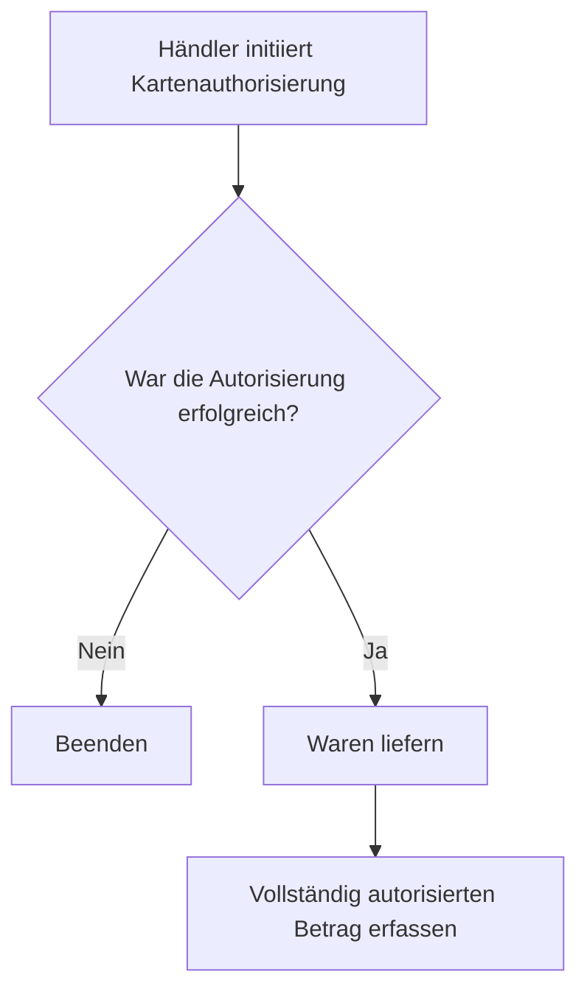
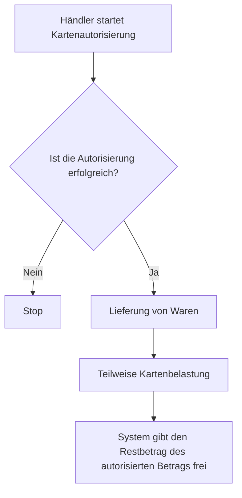

# Capture

<details>
  <summary><em>Themen auf dieser Seite</em></summary>

- [Verständnis von Autorisierung und Capture](#verständnis-von-autorisierung-und-capture)
- [Arten des Capture](#arten-des-capture)
  - [Automatisches Capture](#automatisches-capture)
  - [Manuelles Capture](#manuelles-capture)
  - [Vollständiges manuelles Capture](#vollständiges-manuelles-capture)
  - [Einmaliges teilweises Capture](#einmaliges-teilweises-capture)
  - [Mehrfach teilweises Capture](#mehrfach-teilweises-capture)

</details>

Dieses Dokument erklärt die Schritte im Karten­zahlungs­prozess und stellt die Funktion *Einmaliges teilweises Capture* vor.

import TOCInline from '@theme/TOCInline';

<!-- 
<TOCInline toc={toc} /> -->

## Verständnis von Autorisierung und Capture

Autorisierung und Capture sind die zwei Schritte zur Abwicklung von Kartenzahlungen.

Die Autorisierung erfolgt, wenn der Händler beim Checkout eine Belastung der Karte des Kunden einleitet. Während dieses Prozesses prüft der Zahlungsdienstleister bei der Bank des Karteninhabers, ob das Konto ausreichend gedeckt ist und in gutem Zustand ist. Wenn die Bedingungen erfüllt sind, wird der Transaktionsbetrag reserviert. Durch die Vorautorisierung einer Karte wird sichergestellt, dass die Zahlungsmethode gültig ist und der Karteninhaber echt ist, ohne das Konto tatsächlich zu belasten. Dies hilft, Rückbuchungen zu vermeiden.

Der Autorisierungszeitraum ist die Zeit, für die die Autorisierung gültig bleibt. Der Betrag muss innerhalb dieses Zeitraums erfasst werden. Dieser Zeitraum hängt vom Land ab, beträgt aber in der Regel 7 Tage.

Capture ist der Prozess, durch den die Transaktion abgeschlossen wird. Das Geld wird vom Kundenkonto abgebucht und auf das Händlerkonto überwiesen, wodurch der Transaktionsstatus von *ausstehend* auf *abgeschlossen* wechselt.

## Arten des Capture

Der Capture-Prozess kann entweder automatisch oder manuell erfolgen.

## Automatisches Capture

Beim automatischen Capture werden Zahlungen basierend auf der Capture-Verzögerung automatisch erfasst. Die Capture-Verzögerung ist der Zeitraum zwischen der Zahlungsautorisierung und dem Capture.

Standardmäßig werden Zahlungen beim automatischen Capture unmittelbar nach der Autorisierung erfasst.

## Manuelles Capture

Beim manuellen Capture muss der Händler explizit für jede Zahlung ein Capture anfordern, bevor die Autorisierung abläuft.

Manuelles Capture unterteilt sich in folgende Typen:

- Vollständiges manuelles Capture
- Einmaliges teilweises Capture
- Mehrfach teilweises Capture

## Vollständiges manuelles Capture

Beim vollständigen manuellen Capture wird der autorisierte Betrag vollständig erfasst.

Der beispielhafte Ablauf ist wie folgt:

<div class="center-mermaid">


</div>


### Verwendung

### Autorisierung

### Einen Autorisierungshold mit einem Token auf der Karte erstellen

```
curl https://api.omise.co/charges \
  -u $OMISE_SECRET_KEY: \
  -d "amount=7000" \
  -d "currency=thb" \
  -d "capture=false" \
  -d "card=$TOKEN_ID"
```

## Erfassung

Das folgende Beispiel demonstriert eine vollständige Erfassung von 70 THB.

```
curl https://api.omise.co/charges/$FULL_UNCAPTURED_CHARGE_ID/capture \
  -u $OMISE_SECRET_KEY: \
  -d "capture_amount=7000"
```


## Einzelne Teil-Erfassung

Wir erklären die einzelne Teil-Erfassung anhand eines Beispiels.

Angenommen, ein Kunde kauft Waren im Wert von 70 THB. Seine Karte wird dann mit 70 THB autorisiert. Der Händler kann jedoch nur Waren im Wert von 40 THB liefern. Der endgültige Rechnungsbetrag beträgt 40 THB, was dem Kunden belastet wird. Der verbleibende Betrag von 30 THB, der autorisiert, aber nicht belastet wurde, wird freigegeben.

*Die Transaktion, die die 40 THB vom Kundenkonto belastet hat, ist die einzelne Teil-Erfassung.*

Der illustrative Ablauf ist wie folgt:

<div class="center-mermaid">

</div>

### Wie aktiviert man die Einzelne Teil-Erfassung?

Die einzelne Teil-Erfassung ist standardmäßig aktiviert.

### Anwendungsbeispiel

### Autorisierung

Das folgende Beispiel autorisiert eine Zahlung von 70 THB mit einem Karten-Token:


```
curl https://api.omise.co/charges \
  -u $OMISE_SECRET_KEY: \
  -d "amount=7000" \
  -d "currency=thb" \
  -d "capture=false" \
  -d "card=$ANOTHER_TOKEN_ID" \
  -d "authorization_type=pre_auth"
 ```### Erfassung

Das folgende Beispiel zeigt eine einzelne Teil-Erfassung von 40 THB.


```
curl https://api.omise.co/charges/$PARTIAL_UNCAPTURED_CHARGE_ID/capture \
  -u $OMISE_SECRET_KEY: \
  -d "capture_amount=4000"
```

## Mehrfache Teil-Erfassung

Derzeit unterstützt Omise keine mehrfache Teil-Erfassung.
