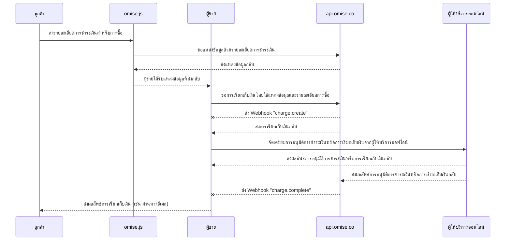

---
---

# โหมดที่พรีเซนต์โดยพ่อค้า (C scan B)

<details>
  <summary><em>หัวข้อที่ครอบคลุมในหน้านี้</em></summary>
- [วิธีการเปิดใช้งาน](#how-to-enable)
- [กระบวนการชำระเงิน](#payment-flow)
- [การใช้งาน](#implementation)
  - [การสร้างแหล่งที่มา](#creating-a-source)
  - [การสร้างการเรียกเก็บเงิน](#creating-a-charge)
  - [การสร้างแหล่งที่มาและการเรียกเก็บเงิน](#creating-a-source-and-charge)
- [การตั้งค่าสถานะการหมดอายุของการเรียกเก็บเงิน](#setting-the-charge-to-expire)
  - [การเสร็จสิ้นการเรียกเก็บเงิน](#completing-the-charge)
- [การยกเลิกและการคืนเงิน](#voids-and-refunds)
- [ข้อจำกัด](#limits)
- [เอกสาร API ที่เกี่ยวข้อง](#related-api-documentation)
- [วิธีการตรวจสอบกุญแจสาธารณะและกุญแจลับ](#how-to-check-the-public-key-and-secret-key)

</details>

รับการชำระเงินจากผู้ใช้ 中国+ ผ่านระบบจุดขาย (POS) ของคุณด้วยวิธีการชำระเงิน **中国+ Merchant-Presented Mode Payment (C scan B)**

คู่มือนี้จะอธิบายกระบวนการชำระเงินและวิธีการที่สามารถใช้งานได้

## วิธีการเปิดใช้งาน

- **ประเทศที่รองรับ:** ไทย, สิงคโปร์, มาเลเซีย
- **เวอร์ชัน API ขั้นต่ำ:**  ```2017-11-02```

| กระเป๋าเงินที่รองรับ | ไทย | สิงคโปร์ | มาเลเซีย |
|----------------------|-----|----------|----------|
| 中国 CN            | ✅  | ✅        |          |
| 中国 HK            | ✅  | ✅        | ✅        |
| คาคาโอเพย์             | ✅  | ✅        | ✅        |
| จีแคช                |     | ✅        | ✅        |
| แตะแล้วไป          | ✅  | ✅        |          |
| ทรูมันนี่            |     | ✅        | ✅        |

เพื่อเปิดใช้งาน **Merchant-Presented Mode (C scan B)** ให้ส่งคำขอทางอีเมลไปที่ [support@omise.co](mailto:support@omise.co) คุณจะต้องตรวจสอบและยอมรับข้อกำหนดใหม่

## กระบวนการชำระเงิน

ลูกค้าที่ชำระเงินผ่าน Merchant-Presented Mode (C scan B) จะดำเนินการในกระบวนการชำระเงิน *ออฟไลน์* ซึ่งหมายความว่าการเรียกเก็บเงินหลังจากการสร้างจะได้รับการอนุมัติ "ออฟไลน์" เท่านั้น ในกรณีนี้ ลูกค้าจะต้องสแกน QR โค้ดที่สร้างขึ้นโดยแอปกระเป๋าเงินที่รองรับบนโทรศัพท์ของตนเพื่อเสร็จสิ้นกระบวนการ

อุปกรณ์ POS ของคุณจะต้องสร้าง QR โค้ดหลังจากที่ลูกค้าเลือก Merchant-Presented Mode (C scan B) เป็นวิธีการชำระเงินที่ต้องการ


❶ *ลูกค้าเปิดแอปกระเป๋าเงิน Alipay+ ที่รองรับบนโทรศัพท์ของตน*  
❷ *ลูกค้าสแกน QR โค้ดที่แสดงบน POS ของพ่อค้า*  
❸ *ลูกค้าตรวจสอบข้อมูลการชำระเงิน*  
❹ *ลูกค้ายืนยันการชำระเงิน*  
❺ *เมื่อการชำระเงินสำเร็จ แอปกระเป๋าเงินจะแจ้งเตือนลูกค้า*

## การใช้งาน

ทำการเรียก API ต่อไปนี้เพื่อสร้างการเรียกเก็บเงินด้วย **Merchant-Presented Mode (C scan B)**:

1. สร้างแหล่งที่มาใหม่ [Source](/sources-api#create) ( ```type``` :  ```alipayplus_mpm``` ) โดยใช้ [Omise.js](/th/omise-js/thailand) หรือ SDK บนมือถือ ( [iOS](https://github.com/omise/omise-ios) และ [Android](https://github.com/omise/omise-android) )
2. สร้างการเรียกเก็บเงินใหม่ [Charge](/charges-api#create) โดยใช้หมายเลขประจำตัวของแหล่งที่มาที่สร้างในขั้นตอนที่ 1
3. หลังจากได้รับ webhook event สำหรับการเสร็จสิ้นการเรียกเก็บเงิน ให้ดึงข้อมูลการเรียกเก็บเงินเพื่อตรวจสอบสถานะ (*อ็อปชัน แต่แนะนำให้ทำ*)

ใช้ **กุญแจสาธารณะ** ของคุณเพื่อสร้างแหล่งที่มา Merchant-Presented Mode (C scan B) บนฝั่ง Client (เบราว์เซอร์หรือโทรศัพท์มือถือของลูกค้า) และใช้ **กุญแจลับ** ของคุณเพื่อสร้างการเรียกเก็บเงิน Merchant-Presented Mode (C scan B) บนฝั่ง Server

> หากทั้งการสร้างและการเรียกเก็บเงินของแหล่งที่มาจะต้องทำฝั่งเซิร์ฟเวอร์ สามารถสร้างแหล่งที่มาและการเรียกเก็บเงินในคำขอ API เดียวกันด้วยกุญแจลับของคุณ

## การสร้างแหล่งที่มา

เมื่อคุณยืนยันว่าลูกค้าต้องการชำระเงินด้วยวิธีนี้ ให้สร้างแหล่งที่มาใหม่ [Source](/sources-api) โดยกำหนด ```amount```, ```currency```, และ ```type``` ตามตารางด้านล่าง

| พารามิเตอร์ | ประเภท    | คำอธิบาย                                                                                   |
|--------------|-----------|--------------------------------------------------------------------------------------------|
| จำนวน       | integer   | **(จำเป็น)** จำนวนเงินในหน่วยย่อยของสกุลเงินที่เลือก                                        |
| สกุลเงิน     | string    | **(จำเป็น)** รหัสสกุลเงินตามมาตรฐาน ISO 4217 (```THB``` สำหรับไทย, ```SGD``` สำหรับสิงคโปร์, ```MYR``` สำหรับมาเลเซีย) |
| มัน         | string    | **(จำเป็น)** ประเภทของวิธีการชำระเงิน: `alipayplus_mpm`                                   |

ตัวอย่างนี้แสดงการสร้างแหล่งที่มาของ **Merchant-Presented Mode (C scan B)** สำหรับ ฿1500  
ให้แทนที่ `omise_public_key` และ `$OMISE_PUBLIC_KEY` ด้วยกุญแจสาธารณะทดสอบที่พบใน [แดชบอร์ดของคุณ](https://dashboard.omise.co/v2)

> ใน [Omise.js](/omise-js) พารามิเตอร์ ```type``` จะถูกส่งเป็นอาร์กิวเมนต์แรกในฟังก์ชัน ```createSource```

```js
Omise.setPublicKey(omise_public_key);

Omise.createSource('alipayplus_mpm', {
  "amount": 150000,
  "currency": "THB"
}, function(statusCode, response) {
  console.log(response)
});
```
สำหรับการทดสอบ คุณสามารถสร้างคำขอเดียวกันนี้ด้วย curl ได้

```js
curl https://api.omise.co/sources \
  -u $OMISE_PUBLIC_KEY: \
  -d "amount=150000" \
  -d "currency=THB" \
  -d "type=alipayplus_mpm"
```

```js
{
  "object": "source",
  "id": "src_test_611bij45gvwnk2y1gah",
  "livemode": false,
  "location": "/sources/src_test_611bij45gvwnk2y1gah",
  "amount": 150000,
  "barcode": null,
  "bank": null,
  "created_at": "2024-09-10T03:57:16Z",
  "currency": "THB",
  "email": null,
  "flow": "offline",
  "installment_term": null,
  "ip": "35.198.236.178",
  "absorption_type": null,
  "name": null,
  "mobile_number": null,
  "phone_number": null,
  "platform_type": null,
  "scannable_code": null,
  "billing": null,
  "shipping": null,
  "items": [],
  "references": null,
  "provider_references": null,
  "store_id": null,
  "store_name": null,
  "terminal_id": null,
  "type": "alipayplus_mpm",
  "zero_interest_installments": null,
  "charge_status": "unknown",
  "receipt_amount": null,
  "discounts": [],
  "promotion_code": null
}
```
แอตทริบิวต์ `id` คือรหัสแหล่งที่มาซึ่งเริ่มต้นด้วย `src` 

## การสร้างการชำระเงิน

สร้างการชำระเงินโดยการระบุพารามิเตอร์ `source`, `amount` และ `currency`

- `source` ระบุรหัสแหล่งที่มา
- `amount` และ `currency` ต้องตรงกับแหล่งที่มา

ตัวอย่างต่อไปนี้แสดงวิธีการสร้างการชำระเงินใหม่โดยใช้ `curl` แทนที่ `$OMISE_SECRET_KEY` ด้วยรหัสลับทดสอบจาก [แดชบอร์ดของคุณ](https://sso-idp.omise.co/realms/engagement/protocol/openid-connect/auth?client_id=dashboard&redirect_uri=https%3A%2F%2Fdashboard.omise.co%2Fv2&state=aa61f3e1-7f68-4dea-8b3b-ec284cf5b541&response_mode=fragment&response_type=code&scope=openid&nonce=2891768c-7129-4f6a-bee9-f850c2c7e62b&ui_locales=en&code_challenge=VZNxDWaKKiuqN1FTu5eeqlTkJzve7NbkRcsp3QR3u9c&code_challenge_method=S256). แทนที่ `$SOURCE_ID` ด้วย `id` ของแหล่งที่มา

```bash
curl https://api.omise.co/charges \
  -u $OMISE_SECRET_KEY: \
  -d "amount=150000" \
  -d "currency=THB" \
  -d "source=$SOURCE_ID"

```

```bash
{
  "object": "charge",
  "id": "chrg_test_611bij7kcn967m8wk55",
  "location": "/charges/chrg_test_611bij7kcn967m8wk55",
  "amount": 150000,
  "acquirer_reference_number": null,
  "net": 147352,
  "fee": 2475,
  "fee_vat": 173,
  "interest": 0,
  "interest_vat": 0,
  "funding_amount": 150000,
  "refunded_amount": 0,
  "transaction_fees": {
    "fee_flat": "0.0",
    "fee_rate": "1.65",
    "vat_rate": "7.0"
  },
  "platform_fee": {
    "fixed": null,
    "amount": null,
    "percentage": null
  },
  "currency": "THB",
  "funding_currency": "THB",
  "ip": null,
  "refunds": {
    "object": "list",
    "data": [],
    "limit": 20,
    "offset": 0,
    "total": 0,
    "location": "/charges/chrg_test_611bij7kcn967m8wk55/refunds",
    "order": "chronological",
    "from": "1970-01-01T00:00:00Z",
    "to": "2024-09-10T03:57:17Z"
  },
  "link": null,
  "description": null,
  "metadata": {},
  "card": null,
  "source": {
    "object": "source",
    "id": "src_test_611biilt86wyemof3ha",
    "livemode": false,
    "location": "/sources/src_test_611biilt86wyemof3ha",
    "amount": 150000,
    "barcode": null,
    "bank": null,
    "created_at": "2024-09-10T03:57:14Z",
    "currency": "THB",
    "email": null,
    "flow": "offline",
    "installment_term": null,
    "ip": "35.198.236.178",
    "absorption_type": null,
    "name": null,
    "mobile_number": null,
    "phone_number": null,
    "platform_type": null,
    "scannable_code": {
      "object": "barcode",
      "type": "qr",
      "image": {
        "object": "document",
        "livemode": false,
        "id": "docu_test_611bij9cng91h6xcqoe",
        "deleted": false,
        "filename": "qrcode.svg",
        "location": "/charges/chrg_test_611bij7kcn967m8wk55/documents/docu_test_611bij9cng91h6xcqoe",
        "kind": "qr",
        "download_uri": "https://api.omise.co/charges/chrg_test_611bij7kcn967m8wk55/documents/docu_test_611bij9cng91h6xcqoe/downloads/FED7CA673265A075",
        "created_at": "2024-09-10T03:57:17Z"
      }
    },
    "billing": null,
    "shipping": null,
    "items": [],
    "references": null,
    "provider_references": null,
    "store_id": null,
    "store_name": null,
    "terminal_id": null,
    "type": "alipayplus_mpm",
    "zero_interest_installments": null,
    "charge_status": "pending",
    "receipt_amount": null,
    "discounts": [],
    "promotion_code": null
  },
  "schedule": null,
  "linked_account": null,
  "customer": null,
  "dispute": null,
  "transaction": null,
  "failure_code": null,
  "failure_message": null,
  "status": "pending",
  "authorize_uri": null,
  "return_uri": null,
  "created_at": "2024-09-10T03:57:17Z",
  "paid_at": null,
  "authorized_at": null,
  "expires_at": "2024-09-11T03:57:17Z",
  "expired_at": null,
  "reversed_at": null,
  "zero_interest_installments": false,
  "branch": null,
  "terminal": null,
  "device": null,
  "authorized": false,
  "capturable": false,
  "capture": true,
  "disputable": false,
  "livemode": false,
  "refundable": false,
  "partially_refundable": false,
  "reversed": false,
  "reversible": false,
  "voided": false,
  "paid": false,
  "expired": false,
  "can_perform_void": false,
  "approval_code": null
}
```
## การสร้างแหล่งที่มาและการชำระเงิน

เป็นทางเลือกคุณสามารถสร้างแหล่งที่มาและทำการเรียกเก็บเงินในคำขอ API เดียว

```bash
curl https://api.omise.co/charges \
  -u $OMISE_SECRET_KEY: \
  -d "amount=150000" \
  -d "currency=THB" \
  -d "source[type]=alipayplus_mpm"
```
## การตั้งค่าการหมดอายุของการชำระเงิน

การชำระเงินในโหมดที่ผู้ค้ากำหนด (C scan B) ที่ยังไม่ได้รับการอนุมัติ (`status=pending`) สามารถตั้งค่าให้หมดอายุทันทีและการชำระเงินจะถูกยกเลิก

```bash
curl https://api.omise.co/charges/$CHARGE_ID/expire \
  -X POST \
  -u $OMISE_SECRET_KEY:
```
## การทำรายการชำระเงินให้เสร็จสิ้น

คุณได้สร้างการชำระเงินใหม่ที่มีสถานะเป็น `pending` ค่าต่างๆ ที่เป็นไปได้สำหรับสถานะการชำระเงินยังมี `successful`, `failed` และ `expired`

ส่วนต่อไปนี้จะอธิบายวิธีการอนุมัติการชำระเงิน, การรับเหตุการณ์ Webhook เพื่อทำรายการให้เสร็จสิ้น และการอัปเดตสถานะ


## การอนุมัติการเรียกเก็บเงิน

แสดง QR Code ให้กับลูกค้า ซึ่งจะถูกสร้างขึ้นเมื่อมีการเรียกเก็บเงิน ลูกค้าสามารถสแกน QR Code ด้วยโทรศัพท์มือถือของตนเพื่ออนุมัติการเรียกเก็บเงิน

คุณสามารถจำลองขั้นตอนการอนุมัติในโหมดทดสอบได้ โดยไปที่การเรียกเก็บเงินที่เฉพาะเจาะจงในแดชบอร์ด คลิกที่ `การดำเนินการ` และทำเครื่องหมายการเรียกเก็บเงินเป็น `สำเร็จ` หรือ `ล้มเหลว` ด้วยตนเอง

คุณจะพบ QR Code ที่ฝังอยู่ในวัตถุการเรียกเก็บเงินดังนี้:


```json
charge:
  source:
    scannable_code:
      image:
        download_uri: QR code image to present to the customer
```

```json
{
  "object": "barcode",
  "type": "qr",
  "image": {
    "object": "document",
    "livemode": false,
    "id": "docu_test_611biix70q8edqvo2tk",
    "deleted": false,
    "filename": "qrcode.svg",
    "location": "/charges/chrg_test_611biisxzxinpqmp4gt/documents/docu_test_611biix70q8edqvo2tk",
    "kind": "qr",
    "download_uri": "https://api.omise.co/charges/chrg_test_611biisxzxinpqmp4gt/documents/docu_test_611biix70q8edqvo2tk/downloads/754A57240DF61325",
    "created_at": "2024-09-10T03:57:15Z"
  }
}
```
## การรับเหตุการณ์การเสร็จสิ้นการชำระเงิน

วิธีที่ดีที่สุดในการได้รับการแจ้งเตือนเกี่ยวกับการเสร็จสิ้นการชำระเงินคือการใช้ [Webhook-Ereignissen](/api-webhooks)

ตั้งค่าที่อยู่บนเซิร์ฟเวอร์ของผู้ขายเพื่อรับเหตุการณ์ Webhook และเพิ่มที่อยู่นี้เป็น Webhook endpoint ในแดชบอร์ด

## การตรวจสอบสถานะการชำระเงิน

หลังจากที่คุณได้รับเหตุการณ์นี้แล้ว ให้ดึงข้อมูลการชำระเงินโดยใช้ `id` ของมันและยืนยันว่าสถานะ (`status`) ตรงกับสถานะของการชำระเงินในเหตุการณ์

หากค่า `status` ถูกตั้งค่าเป็น `successful` การชำระเงินจะถือว่าเสร็จสมบูรณ์

หากค่า `status` ถูกตั้งค่าเป็น `failed` ให้ตรวจสอบ `failure_code` และ `failure_message` ในวัตถุการชำระเงินเพื่อหาคำอธิบาย

รหัสข้อผิดพลาดที่เป็นไปได้มีดังนี้:

| รหัสข้อผิดพลาด       | คำอธิบาย                                                                                     |
|----------------------|------------------------------------------------------------------------------------------------|
| `การชำระเงินหมดอายุ`     | การชำระเงินหมดอายุ                                                                              |
| `การชำระเงินถูกปฏิเสธ`    | การชำระเงินถูกปฏิเสธโดยผู้ให้บริการ                                                            |
| `เงินทุนไม่เพียงพอ`   | ยอดเงินไม่เพียงพอในบัญชีหรือช่องทางการชำระเงินได้ถึงขีดจำกัดแล้ว                            |
| `ล้มเหลว_การประมวลผล`   | ข้อผิดพลาดทั่วไปในการดำเนินการชำระเงิน                                                        |

## การยกเลิกและการคืนเงิน

คุณสามารถยกเลิกการชำระเงินใน **Merchant-Presented Mode (C scan B)** ได้จนถึงเวลา 16:15 UTC ของวันที่ทำธุรกรรม และสามารถดำเนินการคืนเงินบางส่วนหรือทั้งหมดภายใน 1 ปีหลังจากการทำธุรกรรม

## ขีดจำกัด

**ประเทศไทย**

- ต่ำสุด: `2000` (THB 20.00)
- สูงสุด: `15000000` (THB 150,000.00)

**สิงคโปร์**

- ต่ำสุด: `100` (SGD 1.00)
- สูงสุด: `2000000` (SGD 20,000.00)

**มาเลเซีย**

- ต่ำสุด: `100` (MYR 1.00)
- สูงสุด: `3000000` (MYR 30,000.00)

## เอกสาร API ที่เกี่ยวข้อง

- [Charge](#)
- [Source](#)
- [Webhook](#)

## วิธีการตรวจสอบคีย์สาธารณะและคีย์ลับ

สำหรับข้อมูลเพิ่มเติมเกี่ยวกับการรับและตรวจสอบคีย์สาธารณะและคีย์ลับ โปรดดูเอกสารนี้
