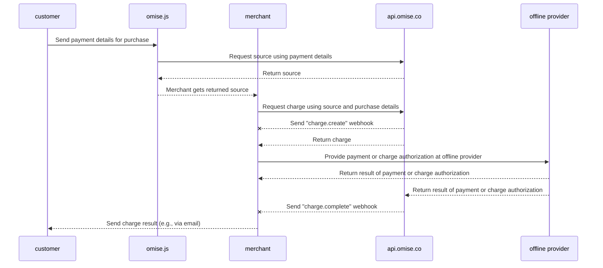

---
---

# Merchant-Presented Mode (C scan B)

<details>
  <summary><em>Topics covered on this page</em></summary>
- [How to enable](#how-to-enable)
- [Payment flow](#payment-flow)
- [Implementation](#implementation)
  - [Creating a source](#creating-a-source)
  - [Creating a charge](#creating-a-charge)
  - [Creating a source and charge](#creating-a-source-and-charge)
- [Setting the charge to expire](#setting-the-charge-to-expire)
  - [Completing the charge](#completing-the-charge)
- [Voids and refunds](#voids-and-refunds)
- [Limits](#limits)
- [Related API documentation](#related-api-documentation)
- [How to check the public key and secret key](#how-to-check-the-public-key-and-secret-key)

</details>

Accept in-store payments from Alipay+ users through your point-of-sale system (POS) using the **Alipay+ Merchant-Presented Mode Payment (C scan B)** payment method.

This guide walks you through the payment flow and details how to implement it.

## How to enable

- **Supported Countries:** Thailand, Singapore, Malaysia
- **Minimum API version:**  ```2017-11-02```

| Supported Wallets | Thailand | Singapore | Malaysia |
|-------------------|----------|-----------|----------|
| Alipay CN         | ✅        | ✅         |          |
| Alipay HK         | ✅        | ✅         | ✅        |
| KakaoPay          | ✅        | ✅         | ✅        |
| GCash             |          | ✅         | ✅        |
| Touch 'n Go       | ✅        | ✅         |          |
| TrueMoney         |          | ✅         | ✅        |

To enable **Merchant-Presented Mode (C scan B)**, send an email requesting this feature to [support@omise.co](mailto:support@omise.co). You will need to review and accept new terms and conditions.

## Payment flow

Customers paying via Merchant-Presented Mode (C scan B) go through an *offline* payment flow. This means that once the charge is created, it can only be authorized "offline". In this case, the customer must scan the generated QR code with the supported wallet app on their phone to complete the flow.

Your POS device should generate the QR code after the customer selects Merchant-Presented Mode (C scan B) as their preferred payment method.


❶ *The customer opens an Alipay+ supported wallet on their mobile phone.*  
❷ *Then, the customer scans the QR code displayed in the merchant POS.*  
❸ *The customer reviews payment information.*  ❹ *The customer confirms the payment.*  
❺ *When the payment is successful, the wallet application will notify the customer.*

## Implementation

Make the following API requests to create a charge using **Merchant-Presented Mode (C scan B)**:

1. Create a new payment [source](/sources-api#create) ( ```type``` :  ```alipayplus_mpm``` ) using [Omise.js](/th/omise-js/thailand) or one of the mobile SDKs ([iOS](https://github.com/omise/omise-ios)  and [Android](https://github.com/omise/omise-android) ).
2. Create a new  [charge](/charges-api#create) using the identifier of the source created in Step 1.
3. After receiving the charge completion webhook event, retrieve the charge to verify its status (*optional, but recommended*).

 Use your **public key** to create the Merchant-Presented Mode (C scan B) source on the client (a customer's browser or mobile phone). Use your **secret key** to create the Merchant-Presented Mode (C scan B) charge on the server.

> If both the creation and charge of a source must happen server-side, you can create and charge the source in a [single API request](/alipayplus-mpm#creating-a-source-and-charge)  using your secret key.


## Creating a source

When the customer confirms that they wish to pay with this payment method, create a new [source](/sources-api) specifying the ```amount```, ```currency```, and ```type```.

| Parameter | Type     | Description                                                                               |
|-----------|----------|-------------------------------------------------------------------------------------------|
| amount    | integer  | **(required)** Amount in subunits of source currency                                        |
| currency  | string   | **(required)**  Currency for source as three-letter ISO 4217 code (```THB``` for Thailand, ```SGD``` for Singapore, ```MYR``` for Malaysia)          |
| type      | string   | **(required)** Payment source type: `alipayplus_mpm`                                        |

The following example demonstrates creating a new **Merchant-Presented Mode (C scan B)** source for ฿1500.  
Replace `omise_public_key` and `$OMISE_PUBLIC_KEY` with the test public key found on [your dashboard](https://dashboard.omise.co/v2).

> Using [Omise.js](/omise-js), the ```type``` parameter is supplied as the first argument to the ```createSource``` method.

```js
Omise.setPublicKey(omise_public_key);

Omise.createSource('alipayplus_mpm', {
  "amount": 150000,
  "currency": "THB"
}, function(statusCode, response) {
  console.log(response)
});
```
For testing, you can create the same request using curl.

```js
curl https://api.omise.co/sources \
  -u $OMISE_PUBLIC_KEY: \
  -d "amount=150000" \
  -d "currency=THB" \
  -d "type=alipayplus_mpm"
```

```js
{
  "object": "source",
  "id": "src_test_611bij45gvwnk2y1gah",
  "livemode": false,
  "location": "/sources/src_test_611bij45gvwnk2y1gah",
  "amount": 150000,
  "barcode": null,
  "bank": null,
  "created_at": "2024-09-10T03:57:16Z",
  "currency": "THB",
  "email": null,
  "flow": "offline",
  "installment_term": null,
  "ip": "35.198.236.178",
  "absorption_type": null,
  "name": null,
  "mobile_number": null,
  "phone_number": null,
  "platform_type": null,
  "scannable_code": null,
  "billing": null,
  "shipping": null,
  "items": [],
  "references": null,
  "provider_references": null,
  "store_id": null,
  "store_name": null,
  "terminal_id": null,
  "type": "alipayplus_mpm",
  "zero_interest_installments": null,
  "charge_status": "unknown",
  "receipt_amount": null,
  "discounts": [],
  "promotion_code": null
}
```

The `id` attribute is the source identifier (begins with `src`).

## Creating a charge

Create a charge specifying the parameters `source`, `amount`, and `currency`.

- `source` specifies the source identifier.
- `amount` and `currency` must match the source.

The following example demonstrates how to create a new charge using `curl`. Replace `$OMISE_SECRET_KEY` with the test secret key on [your dashboard](https://sso-idp.omise.co/realms/engagement/protocol/openid-connect/auth?client_id=dashboard&redirect_uri=https%3A%2F%2Fdashboard.omise.co%2Fv2&state=aa61f3e1-7f68-4dea-8b3b-ec284cf5b541&response_mode=fragment&response_type=code&scope=openid&nonce=2891768c-7129-4f6a-bee9-f850c2c7e62b&ui_locales=en&code_challenge=VZNxDWaKKiuqN1FTu5eeqlTkJzve7NbkRcsp3QR3u9c&code_challenge_method=S256). Replace `$SOURCE_ID` with the `id` of the source.

```bash
curl https://api.omise.co/charges \
  -u $OMISE_SECRET_KEY: \
  -d "amount=150000" \
  -d "currency=THB" \
  -d "source=$SOURCE_ID"

```

```bash
{
  "object": "charge",
  "id": "chrg_test_611bij7kcn967m8wk55",
  "location": "/charges/chrg_test_611bij7kcn967m8wk55",
  "amount": 150000,
  "acquirer_reference_number": null,
  "net": 147352,
  "fee": 2475,
  "fee_vat": 173,
  "interest": 0,
  "interest_vat": 0,
  "funding_amount": 150000,
  "refunded_amount": 0,
  "transaction_fees": {
    "fee_flat": "0.0",
    "fee_rate": "1.65",
    "vat_rate": "7.0"
  },
  "platform_fee": {
    "fixed": null,
    "amount": null,
    "percentage": null
  },
  "currency": "THB",
  "funding_currency": "THB",
  "ip": null,
  "refunds": {
    "object": "list",
    "data": [],
    "limit": 20,
    "offset": 0,
    "total": 0,
    "location": "/charges/chrg_test_611bij7kcn967m8wk55/refunds",
    "order": "chronological",
    "from": "1970-01-01T00:00:00Z",
    "to": "2024-09-10T03:57:17Z"
  },
  "link": null,
  "description": null,
  "metadata": {},
  "card": null,
  "source": {
    "object": "source",
    "id": "src_test_611biilt86wyemof3ha",
    "livemode": false,
    "location": "/sources/src_test_611biilt86wyemof3ha",
    "amount": 150000,
    "barcode": null,
    "bank": null,
    "created_at": "2024-09-10T03:57:14Z",
    "currency": "THB",
    "email": null,
    "flow": "offline",
    "installment_term": null,
    "ip": "35.198.236.178",
    "absorption_type": null,
    "name": null,
    "mobile_number": null,
    "phone_number": null,
    "platform_type": null,
    "scannable_code": {
      "object": "barcode",
      "type": "qr",
      "image": {
        "object": "document",
        "livemode": false,
        "id": "docu_test_611bij9cng91h6xcqoe",
        "deleted": false,
        "filename": "qrcode.svg",
        "location": "/charges/chrg_test_611bij7kcn967m8wk55/documents/docu_test_611bij9cng91h6xcqoe",
        "kind": "qr",
        "download_uri": "https://api.omise.co/charges/chrg_test_611bij7kcn967m8wk55/documents/docu_test_611bij9cng91h6xcqoe/downloads/FED7CA673265A075",
        "created_at": "2024-09-10T03:57:17Z"
      }
    },
    "billing": null,
    "shipping": null,
    "items": [],
    "references": null,
    "provider_references": null,
    "store_id": null,
    "store_name": null,
    "terminal_id": null,
    "type": "alipayplus_mpm",
    "zero_interest_installments": null,
    "charge_status": "pending",
    "receipt_amount": null,
    "discounts": [],
    "promotion_code": null
  },
  "schedule": null,
  "linked_account": null,
  "customer": null,
  "dispute": null,
  "transaction": null,
  "failure_code": null,
  "failure_message": null,
  "status": "pending",
  "authorize_uri": null,
  "return_uri": null,
  "created_at": "2024-09-10T03:57:17Z",
  "paid_at": null,
  "authorized_at": null,
  "expires_at": "2024-09-11T03:57:17Z",
  "expired_at": null,
  "reversed_at": null,
  "zero_interest_installments": false,
  "branch": null,
  "terminal": null,
  "device": null,
  "authorized": false,
  "capturable": false,
  "capture": true,
  "disputable": false,
  "livemode": false,
  "refundable": false,
  "partially_refundable": false,
  "reversed": false,
  "reversible": false,
  "voided": false,
  "paid": false,
  "expired": false,
  "can_perform_void": false,
  "approval_code": null
}
```

## Creating a source and charge

Alternatively, you can create and charge a source in a single API request.

```bash
curl https://api.omise.co/charges \
  -u $OMISE_SECRET_KEY: \
  -d "amount=150000" \
  -d "currency=THB" \
  -d "source[type]=alipayplus_mpm"
```

## Setting the charge to expire

Merchant-Presented Mode (C scan B) charges that have not yet been authorized (`status=pending`) can be set to expire immediately, canceling the charge.

```bash
curl https://api.omise.co/charges/$CHARGE_ID/expire \
  -X POST \
  -u $OMISE_SECRET_KEY:
```
## Completing the charge

You have created a new charge with its `status` set to `pending`. Other possible values for charge `status` are `successful`, `failed`, and `expired`.

The following sections detail how to authorize a charge, receive its completion webhook event, and update its status.



## Authorizing the charge

Present the customer with a QR code generated at charge creation. The customer scans the QR code using their phone to authorize the charge.

You can simulate the authorization phase in test mode. Go to the specific charge on the dashboard, click `Actions`, and manually mark the charge as `Successful` or `Failed`.

Find the QR code nested within the charge object as follows:

```json
charge:
  source:
    scannable_code:
      image:
        download_uri: QR code image to present to the customer
```

```json
{
  "object": "barcode",
  "type": "qr",
  "image": {
    "object": "document",
    "livemode": false,
    "id": "docu_test_611biix70q8edqvo2tk",
    "deleted": false,
    "filename": "qrcode.svg",
    "location": "/charges/chrg_test_611biisxzxinpqmp4gt/documents/docu_test_611biix70q8edqvo2tk",
    "kind": "qr",
    "download_uri": "https://api.omise.co/charges/chrg_test_611biisxzxinpqmp4gt/documents/docu_test_611biix70q8edqvo2tk/downloads/754A57240DF61325",
    "created_at": "2024-09-10T03:57:15Z"
  }
}
```

## Receiving the charge completion event

The best way to be notified about a charge completion is by using [webhook events](/api-webhooks).

Set up a location on the merchant server to receive webhook events and add this location as a webhook endpoint on the dashboard.

## Checking the charge status

After receiving this event, retrieve the charge using its `id` and confirm that its `status` matches the `status` of the charge contained in the event.

 If the value of `status` is `successful`, you got paid.

 If the value of `status` is `failed`, check the `failure_code` and `failure_message` in the charge object for an explanation.

Possible failure codes are as follows.

| Failure Code        | Description                                                                                     |
|---------------------|-------------------------------------------------------------------------------------------------|
| `payment_expired`   | Payment expired.                                                                                |
| `payment_rejected`  | Payment rejected by the issuer.                                                                 |
| `insufficient_fund` | Insufficient funds in the account or the payment method has reached its limit.                  |
| `failed_processing` | General payment processing failure.                                                             |

## Voids and refunds

You can void Merchant-Presented Mode (C scan B) charges until 16:15 UTC on the transaction date and process partial or full refunds within 1 year of the transaction.

## Limits

**Thailand**

- Minimum: `2000` (THB 20.00)
- Maximum: `15000000` (THB 150,000.00)

**Singapore**

- Minimum: `100` (SGD 1.00)
- Maximum: `2000000` (SGD 20,000.00)

**Malaysia**

- Minimum: `100` (MYR 1.00)
- Maximum: `3000000` (MYR 30,000.00)

## Related API documentation

- [Charge](#)
- [Source](#)
- [Webhook](#)

## How to check the public key and secret key

For information on obtaining and checking the public and secret keys, please refer to this document.
