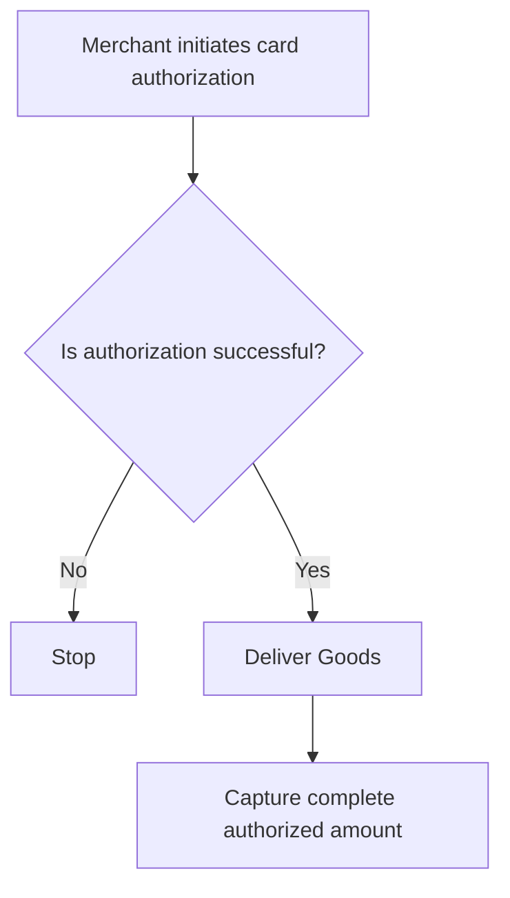
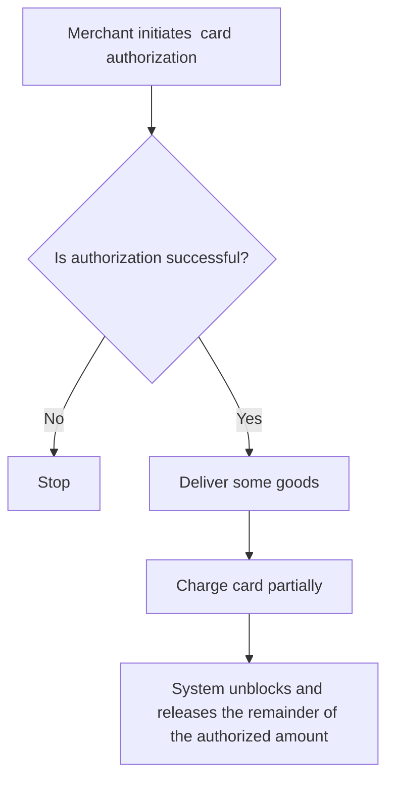

# Capture


<details>
  <summary><em>Topics covered on this page</em></summary>

- [Understanding Authorization and Capture](#understanding-authorization-and-capture)
- [Types of Capture](#types-of-capture)
  - [Automatic Capture](#automatic-capture)
  - [Manual Capture](#manual-capture)
  - [Full Manual Capture](#full-manual-capture)
  - [Single Partial Capture](#single-partial-capture)
  - [Multiple Partial Capture](#multiple-partial-capture)

</details>

This document explains the steps in the card payment process and introduces the Single Partial Capture feature.


import TOCInline from '@theme/TOCInline';

<!-- 
<TOCInline toc={toc} /> -->

## Understanding Authorization and Capture

Authorization and capture are the two steps to complete card payments.

Authorization occurs when the merchant initiates a charge to a customer’s card at checkout. During this process, the payment processor checks with the cardholder’s bank to verify that the account has sufficient funds and is in good standing. If the account meets the criteria, the transaction amount is held pending completion. Pre-authorizing a card ensures that the payment method is valid and that the cardholder is genuine, without charging the account, and helps prevent chargebacks.

The authorization period is the time for which the authorization is valid. The amount must be captured within this time. This period depends on the country but is usually 7 days.

Capture is the process by which the transaction is completed. Funds are withdrawn from the customer account and transferred to the merchant account, moving the transaction status from pending to complete.

## Types of Capture

The capture process can either be automatic or manual.

## Automatic Capture

With automatic capture, payments are captured automatically based on the capture delay. The capture delay is the time period between payment authorization and capture.

With automatic capture, by default, payments are captured immediately after authorization.

## Manual Capture

With manual capture, the merchant must explicitly request a capture for each payment before the authorization expires.

Manual capture is of the following types:

- Full Manual Capture
- Single Partial Capture
- Multiple Partial Capture

## Full Manual Capture

With Full Manual Capture, the authorized amount is captured in full.

The illustrative flow is as follows:

<div class="center-mermaid">


</div>
### Usage

### Authorization

### Create an Authorization hold on the card using a token

```
curl https://api.omise.co/charges \
  -u $OMISE_SECRET_KEY: \
  -d "amount=7000" \
  -d "currency=thb" \
  -d "capture=false" \
  -d "card=$TOKEN_ID"
```

## Capture

The following example demonstrates a full capture of THB 70.

```
curl https://api.omise.co/charges/$FULL_UNCAPTURED_CHARGE_ID/capture \
  -u $OMISE_SECRET_KEY: \
  -d "capture_amount=7000"
```

## Single Partial Capture

Let’s explain Single Partial Capture with an example.

Suppose a customer buys goods worth THB 70. Their card will then be authorized for THB 70. However, the merchant can deliver only THB 40 worth of goods. The final bill amount is THB 40, which is what is charged to the customer’s card. The balance of THB 30 that was authorized but not charged is unblocked and released.

*The transaction that charged the THB 40 to the customer’s card is the single partial capture.*

The illustrative flow is as follows:

<div class="center-mermaid">

</div>

### How to enable Single Partial Capture?

 Single partial capture is enabled by default.

### Usage example

### Authorization

The following example authorizes a charge of THB 70 using a card token:

```
curl https://api.omise.co/charges \
  -u $OMISE_SECRET_KEY: \
  -d "amount=7000" \
  -d "currency=thb" \
  -d "capture=false" \
  -d "card=$ANOTHER_TOKEN_ID" \
  -d "authorization_type=pre_auth"
 ```
### Capture

The following example demonstrates a single partial capture of THB 40.

```
curl https://api.omise.co/charges/$PARTIAL_UNCAPTURED_CHARGE_ID/capture \
  -u $OMISE_SECRET_KEY: \
  -d "capture_amount=4000"
```

## Multiple Partial Capture

At present, Omise does not support Multiple Partial Capture. 


